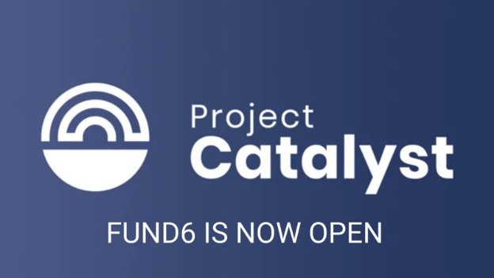
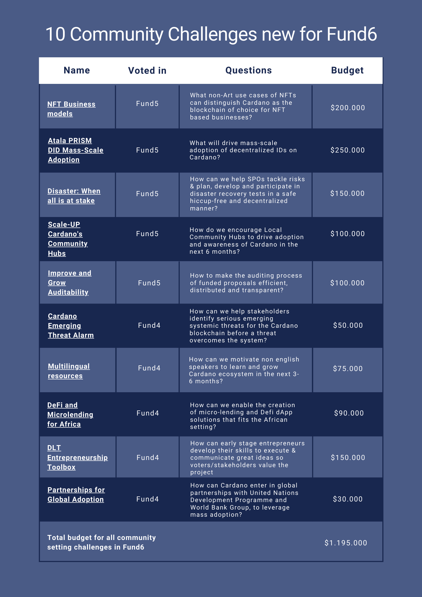

# Project Catalyst Fund6 – our biggest, boldest & best Cardano community innovation fund yet
### **Our exciting experiment continues with new challenges, new features and a $4m fund**
 13 August 2021[ Kriss Baird](tmp//en/blog/authors/kriss-braid/page-1/) 3 mins read

### [**Kriss Baird**](tmp//en/blog/authors/kriss-braid/page-1/)
Product Owner

Commercial

- 
- 
- 

This week, we launched [Project Catalyst Fund6](https://bit.ly/3ACVEEP), with $4m worth of ada available. Proposers can submit proposals for projects that received funding to address real-world challenges and help to build Cardano’s ecosystem. 

Fund6 is our most ambitious fund yet, with more funding being distributed in Fund6 than in all the previous funds combined. For Fund6, we expect around 150 new projects to be voted into existence by the community. There is also $40k worth of ada to be rewarded for proposal referrals. 

18 challenges are available for proposers to respond to and the community votes on which projects receive funding, including 10 community-set challenges, where members of the community have defined the challenges to be addressed. 

In addition:

## **Development upgrades to Catalyst protocol and tech**
Fund6 features new significant upgrades to the Catalyst infrastructure including changes to reward incentives and a significant upgrade to the overall voting experience in the application. This makes it more equitable and attractive for community advisors as well as veteran community advisors to help assess the quality of proposals. 

Voters also have the opportunity to participate using their Ledger and Trezor hardware wallets across Daedalus, Yoroi, and Adalite. 

Fund6 also sees the introduction of voting privacy so voters can take part with the feeling of complete confidence that their votes have tallied as expected and that they are private.

Funded proposals can also benefit from an invitation to join our successful Plutus Pioneer training program, where participants can learn how to implement Plutus smart contracts into their application. 
## **Fund5 key stats**
- ±33 thousand wallets, ±31k IdeaScale members, + more than 150 projects funded to date! 
- Total CA reviews submitted: ±3500
- Total proposals submitted: 930
- Total funds allocated: $3,875,000
- Insight shares: 1,100
- Total votes cast: ±611,000
- Grassroots community thriving
- Still civil & constructive discourse even while in the middle of huge growth.
## **Key dates:**
- 11 August 2021: Fund6 launched at Town Hall with a [Charles Hoskinson keynote presentation](https://youtu.be/crs3lVaGejY)
- 12 August 2021: Innovation phases begin: Insight sharing – to share perspectives on challenges
- **19 August 2021: Proposal submission opens: 1 week for proposers to submit draft ideas to IdeaScale**
- 26 August 2021: Refine ideas: Community provides structured feedback and Proposers edit proposals 
- **9 September 2021: Deadline to finalize proposals and register community advisors for the assessment stage**
- 7 October 2021: Fund6 voting begins
- **1st week of November: Fund6 winners announced**

*Project Catalyst holds weekly Town Halls for the community to learn more about the fund, ask questions, and test out project ideas in the after-Town Hall breakout rooms.*

*You can [register for Town Hall meetings here](https://bit.ly/3rCicSR), join the announcements [Telegram](https://t.me/cardanocatalyst) or subscribe to the [mailing list](https://bit.ly/3dSZJvx).*
