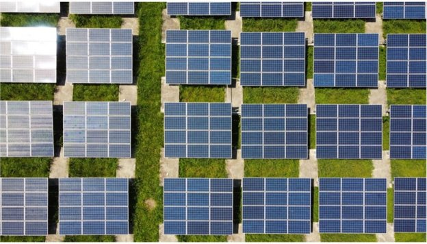

# Why they’re calling Cardano ‘the green blockchain’
### **Staking process avoids the massive energy use and hardware pollution caused by Bitcoin and Ethereum mining**
 17 August 2021[ Fernando Sanchez](tmp//en/blog/authors/fernando-sanchez/page-1/) 5 mins read

### [**Fernando Sanchez**](tmp//en/blog/authors/fernando-sanchez/page-1/)
Technical Writer

Marketing and Communications

- 
- 

Ever since Satoshi Nakamoto published the [Bitcoin whitepaper](https://bitcoin.org/bitcoin.pdf) in 2008, Bitcoin has had its fair share of controversy. The cryptocurrency has often been in the limelight for the wrong reasons. The biggest criticism is how much the mining activities of Bitcoin – and other cryptos such as Ethereum based on proof-of-useless-work – protocols are damaging the environment. Turns out, well, a lot.

[The University of Cambridge](https://cbeci.org/) reckons that mining consumes 100 terawatt-hours (TWh) of electricity a year – that’s one trillion watts *every hour*. To put this figure into perspective, that's 0.55% of the electricity produced in the world each year, enough to run [a country such as Malaysia or Sweden](https://hbr.org/2021/05/how-much-energy-does-bitcoin-actually-consume#:~:text=According%20to%20the%20Cambridge%20Center,like%20a%20lot%20of%20energy). Digiconomist shows the same [energy problem plagues Ethereum](https://digiconomist.net/ethereum-energy-consumption). And the figures continue to rise.

In recent months, the environmental impact of proof-of-work mining has come to the forefront. Mining algorithms require massive amounts of energy. This issue was, up to recently, compounded by the fact that 70% of mining was concentrated in China, where electricity production relies on fossil fuels, particularly burning coal. A recent crackdown by the Chinese authorities has prompted an exodus of crypto miners, which will probably just move the problem to another country. And the issue affects other places anyway. Concerns about energy consumption [led to the shutting down of a mining hub in Mongolia](https://www.cnbc.com/2021/03/02/china-bitcoin-mining-hub-to-shut-down-cryptocurrency-projects.html) in March, for example. 

Profiting from cryptocurrency mining is not restricted by geography or motivation. British police swooped on a building this year expecting to find a cannabis farm, for example. Instead, [they found 100 computer boards mining Bitcoin](https://www.bbc.co.uk/news/uk-england-birmingham-57280115) with an illegal connection to the electricity grid. It was later reported that 'three nerds' had stolen power worth £16,000 a month to make £8,000 in crypto.
### **The greener crypto road**
While fundamental to its function, the proof-of-work algorithms of Bitcoin and Ethereum are their Achilles heel. Powerful, state-of-the-art mining rigs produce better yields, but the faster the rigs are, the more electricity they require. This poses the question of long-term sustainability. A recent post on the [Ethereum Foundation blog](https://blog.ethereum.org/2021/05/18/country-power-no-more/) claimed that ‘Ethereum’s power-hungry days are numbered’ and that its long-awaited move to [proof of stake](https://en.wikipedia.org/wiki/Proof_of_stake) would use 99.95% less energy, although exactly when this shift will take place remains unclear. (‘[Early 2022](https://fortune.com/2021/05/24/ethereum-bitcoin-buterin-carbon-footprint-proof-of-stake/)’ has recently been suggested.)

But what makes proof of stake, as used by Cardano, a more environmentally friendly blockchain?

Proof of work is resource-intensive because miners need to solve ever-more-complex mathematical problems to create blocks. They are in an energy-intensive global race to solve meaningless, randomly generated puzzles. This massive amount of computational power could be used to map the stars, search for alien life, or speed up the [search for Covid vaccines](https://www.weforum.org/agenda/2020/03/covid-19-distributed-computing-vaccine/); but it is just wasted effort. This wasted digital effort leads to real world consequences as well.

The need for powerful hardware leads to a secondary problem: e-waste. Miners always need to keep up with rivals, which means buying more powerful mining rigs. The 'old' equipment – often suitable only for mining – quickly becomes obsolete. It is discarded, and [according to the Digiconomist](https://digiconomist.net/bitcoin-electronic-waste-monitor/), Bitcoin's e-waste is shockingly high. Only 20% of the world's electronic waste is recycled, so the plastics and poisonous materials such as heavy metals in the rigs can end up in landfill. (According to predictions by the United Nations, the world will produce up to 120 million tonnes of e-waste a year by 2050.) 

So why are [commentators in newspapers](https://www.independent.co.uk/life-style/gadgets-and-tech/cardano-crypto-bitcoin-elon-musk-b1849021.html) and on investing blogs such as the [Motley Fool](https://www.fool.com/investing/2021/06/03/why-cryptocurrency-investors-are-excited-about-car/) calling Cardano the ‘green blockchain’? When it comes to sustainability and environment-friendly cryptocurrencies, Cardano has two clear advantages: far less energy consumption, and staking.

In proof of stake, network participants run nodes, and the chain selects a node to add the next block, based on the node's stake and other parameters. So the main difference between these two algorithms (and therefore, in their energy requirements) is that in proof of stake, block producers do not need to spend excessive amounts of time and computer power to solve random puzzles. IOHK chief Charles Hoskinson has estimated that [Cardano’s energy use is just 0.01% of Bitcoin’s](https://www.independent.co.uk/life-style/gadgets-and-tech/cardano-crypto-bitcoin-elon-musk-b1849021.html).

Proof-of-work cryptos need computer power to produce blocks in a pointless, energy-intensive arms race. A Cardano node, in contrast, can be run on a [very low-powered processor](https://armada-alliance.com/), such as a Raspberry Pi. More than 40 million of these have been produced, many for schools in developing countries because they cost just $40-$70. This simplicity also reduces plastic and e-waste.
### **Carbon-neutral blockchains**
The extreme weather events and forest fires of recent months, along with the [UN’s landmark (and chilling) study](https://www.bbc.co.uk/news/science-environment-58130705) into global warming and climate change, has thrown this into even-sharper relief. Deforestation, ice-shelf depletion, and global warming are all in the public eye. Heat waves in many parts of the world are damaging the environment, and forest fires are devastating many areas. Consequently, anything that contributes to the sustainability problem comes under scrutiny. This includes the growing cryptocurrency industry.

On December 12 2015, 196 countries signed up to the Paris Agreement, a legally binding treaty to limit global warming to 2C. A ['net-zero emissions' race](https://eciu.net/netzerotracker) is now underway, aiming to cut carbon dioxide emissions sharply by 2050. The next stage in this process is [COP26](https://ukcop26.org/), the United Nations conference in Glasgow in November. 

When it comes to addressing environmental problems, there are no easy answers. Cardano is a decentralized platform that can replace the inefficiencies of older and legacy systems. With its sustainability credentials, Cardano, and other proof-of-stake protocols, are seen as part of the solution, rather than contributing to the problem caused by Bitcoin and Ethereum.
