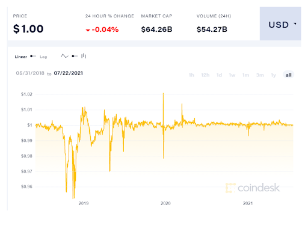

# Djed: implementing algorithmic stablecoins for proven price stability
### **Djed is the first coin to use formal verification to eliminate price volatility**
 18 August 2021[ Olga Hryniuk](tmp//en/blog/authors/olga-hryniuk/page-1/) 7 mins read

### [**Olga Hryniuk**](tmp//en/blog/authors/olga-hryniuk/page-1/)
Technical Writer

Marketing & Communications

- 
- 

Cryptocurrency volatility is one of the obstacles to its wider adoption. Blockchain technologies provide benefits such as transparency, data immutability, and proven security of financial operations. Yet, it is harder than fiat currencies to predict how the market will behave, or forecast the value of a digital currency. This hinders using cryptocurrencies as accounting and exchange units in daily operations.

A stablecoin is a cryptocurrency pegged to a basket of fiat currencies or a single currency (eg, USD or EUR); commodities like gold or silver; stocks; or other cryptocurrencies. Stablecoins include mechanisms that maintain a low price deviation from their target price and so are useful to store or exchange value, as their built-in mechanisms remove the volatility. 

Some stablecoins lack transparency and liquidity of their reserves, which compromises their price stability. To address these challenges, IOG has teamed up with Emurgo, another of the three founding partners of Cardano, and the Ergo blockchain, which uses UTXO-based accounting like Cardano, to work on a stablecoin contract called Djed. Djed is based on algorithmic design. This means it uses smart contracts to ensure price stabilization, and that the coin will be useful for decentralized finance (DeFi) operations. 
## **How stablecoins work**
Different mechanisms contribute to the stability of the coin’s value and help eliminate price variations. These mechanisms are underpinned by the economic principles of supply and demand. 

A common mechanism is backing the stablecoin by a reserve of the currency used as the peg. If demand is higher than the supply of sell or buy orders, this supply should be increased to avoid fluctuations in the price. Typically, stablecoin reserves are not stored in cash. Instead, they are kept in interest-bearing financial instruments such as bonds. The returns on these provide revenue for the operator. 

As long as the stablecoin is fully backed by reserves in the currency to which it is pegged – and the operator can react quickly to variations in demand – price stability is maintained. 
## **Common risks**
Stablecoin reserves are commonly associated with investments. The lack of liquidity of these investments may prevent the operator from reacting quickly to demand. This compromises stability in the short term.

A drawback of fiat-backed stablecoins is that they require trust in the entities keeping the reserves. Lack of the reserves’ transparency or of the ‘full-backing’ claim, combined with inefficient stabilization measures, have already caused Tether stablecoin (USDT) to fall below $0.96, as shown in Figure 1.

Figure 1. Price of the Tether stablecoin (USDT) in the past three years

Issues of transparency do not arise when the backing asset is a cryptocurrency on a public blockchain. Furthermore, the use of smart contracts ensures efficient and reliable execution of stabilization measures due to its automated and secure mechanisms.
## **Enhanced stabilization mechanisms of Djed algorithmic stablecoin**
Djed is a crypto-backed algorithmic stablecoin contract that acts as an autonomous bank. It operates by keeping a reserve of *base coins*, and minting and burning *stablecoins* and *reserve coins*. The contract maintains the peg of stablecoins to a target price by buying and selling stablecoins, using the reserve, and charging fees, which accumulate in the reserve, as shown in Figure 2. The ultimate beneficiaries of this revenue stream are holders of reserve coins, who boost the reserve with funds while assuming the risk of price fluctuation.

Figure 2. How Djed works

The Djed stablecoin is designed as an asset pegged to a fiat currency (USD), along with a governing algorithm. This approach provides a stable means of exchange. But Djed is not limited to being pegged to the dollar. It can work with other currencies, as long as there are oracles providing the contract with the corresponding pricing index.
## **The first formally verified stablecoin protocol**
Djed is the first *formally verified* stablecoin protocol. The use of formal methods in the programming process has greatly contributed to the design and stability properties of Djed. Using formal techniques, the properties are proven by mathematical theorems:

- **Peg upper and lower bound maintenance**: the price will not go above or beyond the set price. In the normal reserve ratio range, purchases and sales are not restricted, and users have no incentive to trade stablecoins outside the peg range in a secondary market.
- **Peg robustness during market crashes**: up to a set limit that depends on the reserve ratio, the peg is maintained even when the price of the base coin falls sharply.
- **No insolvency**: no bank is involved, so there is no bank contract to go bankrupt.
- **No bank runs**: all users are treated fairly and paid accordingly, so there is provably no incentive for users to race to redeem their stablecoins.
- **Monotonically increasing equity per reserve coin**: under some conditions, the reserve surplus per reserve coin is guaranteed to increase as users interact with the contract. Under these conditions, reserve coin holders are guaranteed to profit. 
- **No reserve draining**: under some conditions, it is impossible for a malicious user to execute a sequence of actions that would steal reserves from the bank.
- **Bounded dilution**: there is a limit to how many reserve coin holders and their profit can be diluted due to the issuance of more reserve coins.
## **Djed versions**
There are two versions of Djed:

- **Minimal Djed**: this version is designed to be as simple, intuitive, and straightforward as possible, without compromising stability. 
- **Extended Djed**: this more complex version provides some additional stability benefits. The main differences are the use of a continuous pricing model and dynamic fees to further incentivize the maintenance of the reserve ratio at an optimal level.
## **Implementations**
IOG, Ergo, and Emurgo teams have been working on the implementation of the Djed algorithmic stablecoin contract earlier in 2021 to test different models. 

The first implementation of a Djed stablecoin contract was [SigmaUSD](https://sigmausd.io/#/) on Ergo. This was the first algorithmic stablecoin deployed on a UTXO-based ledger in Q1 2021. It had a fee of 1% for buying or selling operations, and an oracle that updated the exchange rate every hour. This initial version was subject to a reserve draining attack by an anonymous user who owned a large number of ERGs (Ergo’s native coin). The attack was ultimately unsuccessful, and it is estimated that the attacker lost $100,000. 

To further discourage such attacks, this initial deployment of Minimal Djed was replaced by a version where the fee was set to 2%, the oracle updated every 12 minutes, and every oracle update was allowed to change the price by at most 0.49%, unless the price difference was greater than 50%. This provided stronger resilience against reserve draining attacks. 

Djed has also been implemented by the IOG team in Solidity. One version uses the native currency of the Ethereum blockchain as a base coin, and another uses any ERC20-compliant token as a base coin. So far, these implementations have been deployed to testnets for Binance Smart Chain’s testnet, Avalanche’s Fuji, Polygon’s Mumbai, Ethereum’s Kovan, Ethereum’s Rinkeby, and RSK’s testnet.
## **Djed: Cardano implementation**
The Alonzo update to Cardano will enable smart contracts using Plutus. Plutus is powered by Haskell, which guarantees a safe, full-stack programming environment.

Draft implementation of an earlier version of Minimal Djed is [available in the Plutus language](https://github.com/input-output-hk/plutus/blob/master/plutus-use-cases/src/Plutus/Contracts/Stablecoin.hs). In this implementation, stablecoins and reserve coins are native assets uniquely identified by the hash of the monetary policy that controls their minting and burning according to the Djed protocol. This implementation also assumes that oracle data such as the exchange rate is provided as signed data directly to the transactions, instead of being posted on-chain.

There is also an ongoing OpenStar implementation. OpenStar is a framework for private permissioned blockchains developed in Scala. The implementation of Djed using OpenStar follows the idea of off-chain smart contract execution to have a stablecoin on Cardano that does not depend on smart contracts executed on-chain.

To find out more about Djed stablecoin, see the [recently published research paper](https://iohk.io/en/research/library/papers/djeda-formally-verified-crypto-backed-pegged-algorithmic-stablecoin/) or check out the [presentation by Bruno Woltzenlogel Paleo](https://www.youtube.com/watch?v=zG-rxMCDIa0&t=8366s), IOG technical director, at Ergo summit 2021.

*We’d like to thank and acknowledge Bruno Woltzenlogel Paleo for his input to this article and support throughout the process of its creation.*
