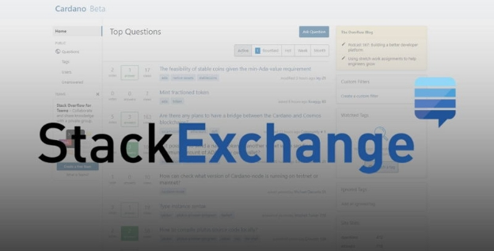

# Cardano Stack Exchange: a growing and vibrant community developer resource
### **Learn about this dedicated community hub that supports Cardano developers**
 19 August 2021[ Neil Burgess](tmp//en/blog/authors/neil-burgess/page-1/) 4 mins read

### [**Neil Burgess**](tmp//en/blog/authors/neil-burgess/page-1/)
Technical Writer

Marketing & Communications

- 
- 

The Cardano ecosystem is committed to supporting and growing our developer community. A vibrant, informed community is essential to the development of a decentralized, functional ecosystem with a diverse user base. In line with our open-source approach, as we evolve Cardano together, everyone can benefit from its decentralized financial solutions while delivering best-in-class blockchain technology. 

To reach our common goals, it is essential that everyone participates in the development process and can always get the information, guidance, and assistance they need.

To support this mission, we are encouraging development talent and experts from across the globe to gather in one place – [Cardano Stack Exchange](https://cardano.stackexchange.com/). This developer hub is the ideal place to share experiences, ask and answer questions about all the streams of Cardano development and operations, and share resources. This site – being driven by members of the Cardano community – is one of the resources to help you learn how to develop decentralized applications (DApps) and write smart contracts.
### **What is Stack Exchange?**
Cardano Stack Exchange originated from [Stack Overflow](https://en.wikipedia.org/wiki/Stack_Overflow), the free community website for developers created by [Jeff Atwood](https://en.wikipedia.org/wiki/Jeff_Atwood) and [Joel Spolsky](https://en.wikipedia.org/wiki/Joel_Spolsky) in 2008. The name was chosen by a voting process in April 2008 by readers of Coding Horror, Atwood's popular programming blog. From this beginning, the movement has grown to host many specialized [Stack Exchanges](https://stackexchange.com/sites). 

One of the newest is dedicated to Cardano developers. Currently in beta, it is a community-moderated question-and-answer site where all Cardano developers, including Plutus pioneers, can get expert answers to a variety of questions, ranging from installation queries to configuration and implementation details.

This community-driven, decentralized philosophy of Stack Overflow fits particularly well with the open-source, decentralized philosophy of Cardano.
### **How it works**
If you are stuck on an issue in Cardano, or curious about an element of its technology, the Stack Exchange is a great resource. It serves more as a place for specific questions about real problems than a discussion site like the [Cardano Forum](https://forum.cardano.org/). This format means that you can easily find the questions you are looking for without getting lost in long-winded discussion threads. Once you come on board, you will have the opportunity to search all previous questions and suggested resolutions.

Examples of questions currently being answered on the site include:

[What happens to staked ada after transferring ada to another wallet?](https://stackoverflow.com/questions/67611246/what-happens-to-staked-ada-after-tranfering-ada-to-another-to-wallet)

[What is the maximum number of addresses in a Cardano Wallet?](https://cardano.stackexchange.com/questions/2337/cardano-wallet-maximum-amount-of-addresses)

[How to create a serialized transaction without a local full node?](https://cardano.stackexchange.com/questions/2335/how-can-i-create-a-serialized-transaction-that-can-be-submitted-to-the-blockchai)

Your question might have already been answered; in this case, you can see how many times it has worked for someone. On the other hand, if you have a new question, someone else will probably encounter the same issue, and your question and answer will be helpful for them.

Cardano developers and support staff regularly check the site and will provide answers where they can. You can check for new questions too, and maybe provide an answer for someone else. The community [elects the moderators](https://stackoverflow.com/help/site-moderators) and upvotes questions and answers to show appreciation.

The more you use the site, the more valuable it becomes. Users gain [reputation points](https://meta.stackexchange.com/questions/7237/how-does-reputation-work) by asking questions, upvoting questions and answers, and providing answers to fellow developers. Reputation points increase your overall score and earn you more site privileges. Many people find that explaining something to another developer is one of the best ways to deepen their own understanding. The best way to learn, as they say, is through teaching.
### **How to get involved**
We’re very keen to establish and grow our Stack Exchange presence. The site is currently in beta and can only grow with community usage and support. This is where you come in. We’d like to encourage you to ask a question – or a bunch of them if you like! 

The site is completely free to use. Just provide an email address, set your password, and you’re good to go!

When someone from the community answers your question, you can return the favor by helping your fellow developers with possible resolutions and suggestions to their questions. When you receive an answer that works for you, remember to accept and upvote it. Considering the search terms that others might use will help you write [a good question](https://stackoverflow.com/help/how-to-ask).

With the site currently still in beta phase, it needs wider adoption and activity to progress to full production. We encourage you to log on, get involved, and help make the site a valuable resource for everyone in the community.

*The Stack Exchange initiative is truly a Cardano community effort. So particular thanks to [all the contributors](https://area51.stackexchange.com/proposals/125174?phase=beta&users=reputation#tab-top) working to drive this project forward.*
##### ***I would like to acknowledge Neil Burgess for his contribution to this article.***
