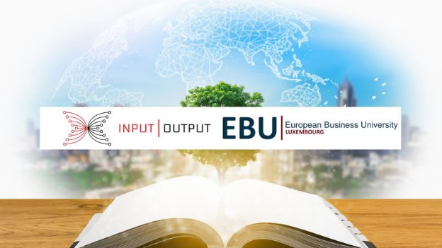

# Making education in Africa more accessible, affordable, and equitable
### **Announcing a new strategic partnership between IOHK and the European Business University of Luxembourg (EBU)**
 24 August 2021[ Niamh Ahern](tmp//en/blog/authors/niamh-ahern/page-1/) 4 mins read

### [**Niamh Ahern**](tmp//en/blog/authors/niamh-ahern/page-1/)
Education Manager

Education

- 
- 
- 
- 

We are pleased to announce a new and exciting partnership between IOHK and the [European Business University of Luxembourg](https://ebu.lu/) (EBU) to make education accessible for everyone in developing countries.

EBU is a renowned educational provider and non profit organization dedicated to higher education and [certificate programs](https://connect.ebu.lu/). They are partnered with over 36 key global organizations and currently educate over 2000 students in 25 countries on the African continent. Together, we intend to roll out our training programs on a wider scale. We firmly believe that EBU can play a pivotal role in furthering the prospects of the people of Africa with this expansion of their scholarship program that will provide great benefits to prospective students.

The objective of this partnership is to expand the teaching and content material with the provision of courses in Plutus and Haskell to a broader audience, thereby empowering people in developing countries to learn new skills and become self-sufficient. 

Working closely with Alexis Hague and Dr. James Mulli, directors at the European Business University of Luxembourg (EBU), this new partnership will be sponsored by IOHK’s director of education, Lars Brünjes, in conjunction with our IOHK education team. The collaboration will give a wealth of new African students access to educational material for free, whilst also supporting our mission in the region. 
### **Widening the reach of education in Africa**
These programs have been developed to meet the increasing demand for Haskell programmers and enable students to work on DeFi solutions, application programming, tokenization projects, and smart contract development.

IOHK will support the Plutus-Haskell offering that EBU plans to deliver to students with teaching and content material for the provision of these courses. EBU will promote the IOHK goal of bringing smart-contract developer expertise to students and relevant stakeholders in Africa and other continents. This is a very positive benefit to those people who are interested in getting up to speed and ready for the Alonzo release that will deliver smart contract functionality.
### **How will the scholarship program work?**
EBU will include Haskell in their curriculum and offer courses in Plutus and Haskell to students who are enrolled in the EBU Certificate program at no tuition cost to the student, but with a €10 commitment fee. In addition, students who join the [EBU Ambassador program](https://www.youtube.com/watch?v=NukBbBP43Ss) will be incentivized to grow the courses using an “Earn as you Learn” stipend for bringing new students on board. Both of these rewards offer direct benefits to the students who enroll on our courses and will help us to grow and expand this program organically.

IOHK and EBU will work together to support the implementation of each other’s missions for education and creating opportunities for people in developing countries. This will be achieved using tools such as an education for all approach, the provision of learning hubs with internet for participants, and the practical implementation of blockchain solutions. 
### **How can I sign up?**
If you are interested in signing up for these training programs ahead of the start of EBU’s new term on September 27th, please visit the [EBU scholarship website](https://connect.ebu.lu/) to register and enroll. Participants will then receive a coupon code to use for enrollment. We are pleased to confirm that the price of these courses will be waived and only includes a nominal administration fee. If you have any questions, please contact [EBU admissions](mailto:admission@ebu.lu) or [EBU administration](mailto:admin@ebu.lu).
### **Looking forward**
We plan to release these training programs and content publicly in GitHub in the near future, so that other institutions can follow this approach and roll out their own Haskell and Plutus training courses. Stay tuned for more details on availability of this content coming soon. 
