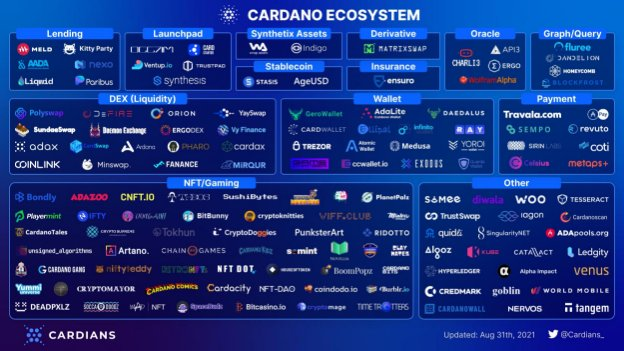

# Today will feel like a destination. Yet a new, exciting journey begins...
### **The Alonzo upgrade is an epochal moment in the birth of a new ecosystem**
 12 September 2021[ Tim Harrison](tmp//en/blog/authors/tim-harrison/page-1/) 10 mins read

### [**Tim Harrison**](tmp//en/blog/authors/tim-harrison/page-1/)
VP of Community & Ecosystem

Communications

- 
- 
- 
- 

Later today, we'll deploy Plutus smart contract capabilities onto the Cardano mainnet via a hard fork combinator (HFC) protocol upgrade event.

The *Alonzo* upgrade will bring highly anticipated capabilities to Cardano through the integration of Plutus scripts onto the blockchain. These will allow the implementation of smart contracts on Cardano, enabling a host of new use cases for decentralized applications (DApps) for the very first time. 

It’s only just the beginning. But this is still a moment for celebration. As a community, we have been on an incredible journey together. Rightly, we should allow ourselves to acknowledge the tremendous efforts made by so many to get here. This will also be a time for reflection on the challenges we've collectively overcome. 

While we might allow ourselves some brief downtime, this is no moment to rest up. And there is certainly no room for hubris. This is where the mission truly begins as we – the whole community – start delivering on the vision we have all been working towards for so long. Building a decentralized system that extends economic identity and opportunity to everyone, everywhere.
## **The road to here**
While many years of research and development have prepared the ground, it was the [Byron reboot](https://iohk.io/en/blog/posts/2020/03/30/what-the-byron-reboot-means-for-cardano/) in March 2020 that truly laid the foundations for the network we have today, by providing a robust and scalable code base on which to build. In July the same year, the [Shelley upgrade](https://cryptoslate.com/cardano-has-launched-the-shelley-mainnet-heres-what-you-need-to-know/) shifted Cardano from a federated model towards a decentralized one.

Since the end of March 2021, when we adjusted the network decentralization parameter to D=0, every block has been produced by a [decentralized network](https://iohk.io/en/blog/posts/2021/03/31/decentralization-to-d-0-day-and-beyond/) from a community of 2,868 stake pools.

It’s a remarkable staking ecosystem that continues to grow rapidly. According to statistics from Cardano data aggregation tool [Pooltool](https://pooltool.io/), the number of ada staking wallets today stands at 825,755. This represents an increase of 35%+ since June. At the time of writing, the total ada delegated to stake pools is valued at $ 59.86 billion, accounting for 71.4% percent of total ada supply ($ 83.9b).

March’s [Mary](https://iohk.io/en/blog/posts/2021/02/04/native-tokens-to-bring-new-utility-to-life-on-cardano/) upgrade created a multi-asset network and introduced native tokens. As well as providing an alternative to the ERC20-type model, Mary released a Cambrian Explosion of creativity. With low minting and transaction fees and, uniquely, no need for smart contracts for Cardano NFTs, we have seen the blooming of an incredible NFT ecosystem. According to data from [pool.pm](https://pool.pm/tokens) (powered by Smaug pool), Cardano has seen 780,436 tokens minted to date and 19,419 policies. All without the need for smart contracts.
## **Enter Alonzo**
The Alonzo upgrade (named after the pioneering American mathematician [Alonzo Church](https://en.wikipedia.org/wiki/Alonzo_Church)), will build on this success. Deployed using the same [HFC technology](https://iohk.io/en/blog/posts/2020/05/07/combinator-makes-easy-work-of-shelley-hard-fork/) used in previous upgrades, this will mark the beginning of a fresh period of rapid growth. By allowing Plutus scripts to be written and executed on-chain, we’ll have the backbone for a new decentralized application platform, enabling numerous DApp and decentralized finance (DeFi) use cases – from simple swap type apps to decentralized exchanges (DEXs), and more complex computational programs such as Oracles and crypto-backed algorithmic stablecoins.

So, we have one of the most decentralized, sustainable, robust, and advanced blockchain platforms in the world, run by a skilled community of stake pool operators (SPOs). We enjoy an informed and passionate community of delegators. We have a thriving NFT ecosystem, attracted by the ease and low-cost of minting. Oh, and a roadmap for future governance through *Voltaire* and ultimate scalability through *Basho* and Hydra scaling. The future is bright and stretches far; we’ll continue to travel the long road together.
## **The birth of a new developer ecosystem**
All the core building blocks are in place. Platform. Vision. Mission. Community. It is still very early days for smart contracts and DeFi, yet we have made great progress already.

Thousands of developers have been taking part in the [Plutus Pioneers course](https://testnets.cardano.org/en/plutus-pioneer-program/), learning the fundamentals of Cardano’s native development framework. Scores of projects have already started developing in Plutus and are at various stages of expertise and readiness. Hundreds of projects have been actively working on the various Cardano testnets and privately-hosted solutions. Some 150 projects are developing their ideas via Cardano’s [Project Catalyst](https://iohk.io/en/blog/posts/2021/02/12/our-million-dollar-baby-project-catalyst/) innovation program, the world’s largest decentralized innovation fund. In the latest round, 800 – yes, 800 – projects applied for $4m-worth of funding. With a treasury now worth well north of $1bn at today’s values, and [33k+ members](https://cardano.ideascale.com/), the future for building on Cardano couldn’t be brighter.

For a snapshot of just how many projects and organizations comprise the ecosystem, visit our [Essential Cardano](https://github.com/input-output-hk/essential-cardano/blob/main/essential-cardano-list.md) repo. Or check out the various excellent ecosystem maps (these are representative, though none are comprehensive) out there like those from the [Cardians](https://twitter.com/Cardians_/status/1432534228890124294?s=20) (see Figure 1). These don’t represent what projects will be visible right away. But they offer a beautiful vista.

Figure 1. Ecosystem map by @Cardians\_

We look forward to seeing these projects evolve as they head towards deployment. Some are close to the launch pad, others further off. Following the release of our first full public testnet earlier this month, and now the mainnet, we expect to see many start to ramp up their development activity.
## **We are still early**
Let us be clear. There will be bumps in the road. Early user experiences might not be perfect. Some early DApps will have issues. We'll see some great development teams and some poor ones. This is a permissionless, decentralized blockchain, so this is inevitable. And a few DApps may prove insecure. Cardano’s secure layer 1 platform offers robustness and high assurance – and Plutus is designed to minimize the potential for exploits. But poor coding practice can always introduce risks for DApp users. Inevitably too, we can expect bad actors looking to take advantage via hacks, exploits, and the likes. 

As a community, we need to be vigilant as our ecosystem matures. In fact, we believe that to mature across the industry as a whole, certification needs to be taken more seriously. At the [summit](https://summit.cardano.org/), we’ll announce plans on how – along with a number of strategic partners – we’ll be supporting the creation of new standards and solutions.
## **Do Your Own Research**
As ever, we encourage everyone to do your own research (DYOR). Look to your fellow community members for ‘crowdsourced due diligence’ and provide your own contributions. Look for projects with a positive history of open and transparent communication, properly maintained social channels/websites, and technical track records. Be sensible out there, especially in these early days. Alongside confidence in DApp security and project intent, DApp discovery will also be key to the healthy growth of the Cardano ecosystem. So expect to hear more on that at the summit, too.

The summit will also be a time for celebration, although there will be those who will seek to sour this. While our community is always open to being challenged in good faith, we have grown too used to Twitter’s and Reddit’s fear, uncertainty, and doubt (FUD) – from the biased and the willfully ignorant. Every project receives its share of this toxicity, and a greater degree is inevitable around major releases.

This is a disappointing element of our immature industry. We need to do better if we want to accelerate wider adoption. The FUD has been particularly virulent this past week. For me, it's a daily part of the job. Fortunately, most of my colleagues focus on building and don't concern themselves too much with CryptoTwitterâ„¢. 

We shall see plenty more FUD and nonsense over the weeks ahead. Things will likely get uglier before they get better. Whatever. This will only strengthen our resolve to prove the naysayers wrong. We also have a vibrant and passionate community that never fails to support the project and respond with facts and courtesy. That continues to make everyone working on Cardano exceptionally proud. Thank you.
## **We are still early**
Let’s remain steadfast through the storm. And focus instead on a bright horizon. We expect to see the first simple smart contract scripts deployed on Cardano within hours of the HFC event. It will take a while longer for more sophisticated DApps to start rolling out via the public testnet. With hundreds of projects building behind the scenes, we expect to see projects deploy through September and October, and accelerate through Q4. Especially with launchpads, tools and frameworks, including the Plutus Application Backend (PAB), and community-created APIs becoming available.

There are high expectations resting on this upgrade. Some unreasonably so. Cardano watchers may be expecting a sophisticated ecosystem of consumer-ready DApps available immediately after the upgrade. Expectations need to be managed here. We should remember that another [well-known blockchain project](https://www.coindesk.com/tech/2020/07/31/ethereum-history-in-5-charts/) which launched in July 2015 had to wait over two years before its first DApp (something to do with cats?) gained real user traction.
## **Steady iteration and improvements**
Over the coming months, we’ll continue our cadence of fortnightly releases of new code, regular maintenance upgrades, and major HFC events each quarter. We shall continue to tune and optimize the platform, adjust performance, and refine pricing parameters as we track and monitor usage patterns. Only real usage will reveal how we need to adjust our flexible and scalable platform over the months of growth ahead. We shall also be looking to the growing developer community and the Cardano Improvement Proposal (CIP) process to bring further capability based on key requirements and needs.

The Alonzo HFC event will deploy Plutus 1.0, the core platform which itself will continue to evolve and bring more functionality over the coming months. Plutus is our native language, but of course, it is only the beginning here too. New bridges, sidechains, and other layer 2 solutions will bring in fresh options and an ever wider developer base. Future upgrades stemming from the work being done on Hydra will add further capability. Research papers like stablecoins, Babel coins, and stable fees will also in time start moving toward the prototype phase, bringing further innovation to the longer-term roadmap.

So, while we remain focused on continuing to research and develop longer-term utility for the platform, the ecosystem will evolve fast over the coming months. It's going to be quite a ride, with a huge amount of activity within the community. 
## **Exciting times ahead**
The Alonzo upgrade is a transformational network upgrade that will catalyze a blossoming ecosystem of developers, creators, and innovators. Later this month, we’ll have the [Cardano summit](https://summit.cardano.org/). This week, we finalized the sessions. With over 100 sessions and more than 40 hours of content spread over multiple tracks across two full days, this will be the most significant event in Cardano’s history. It will be a celebration across virtual worlds and real-life meetups, a showcase of where we are today, and a forum to talk about where we’re heading. A reflection of a budding ecosystem that, while young, has always shown great maturity of purpose. And a platform for exciting new announcements.

So as we pass the epoch boundary today, let's take that moment. We can allow ourselves a celebratory whisky or two (even if it's just a cheeky splash in our morning coffee for our friends in Asia and the Southern hemisphere).

Let’s be proud of what we have achieved. But this is where the real work begins.

Let’s go.
