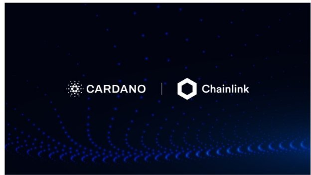

# Cardano to integrate Chainlink oracles for real-time market data
### **Our new collaboration will add additional support for developers building smart contracts for Cardano DeFi applications**
 25 September 2021[ Tim Harrison](tmp//en/blog/authors/tim-harrison/page-1/) 4 mins read

### [**Tim Harrison**](tmp//en/blog/authors/tim-harrison/page-1/)
VP of Community & Ecosystem

Communications

- 
- 
- 
- 

At the heart of the potential of DeFi and RealFi is the use of blockchain-based peer-to-peer technology to build reliable and transparent financial products using oracles and smart contracts. During today’s Cardano Summit, we announced an exciting new strategic collaboration with Chainlink Labs that will help developers build smart contracts for Cardano DeFi applications.

Access to real-world databases will be supplied through Chainlink’s decentralized ‘oracle’ networks which provide tamper-proof, high-quality external data to blockchains, enabling ‘smart contracts’ to execute around datasets such as election results, sports stats, and cryptocurrency rates. Another example that might be quite useful is in the provision of weather data. Chainlink Labs works with several FinTech startups that are trying to enable parametric insurance in sub-Saharan Africa. Secure, verifiable and robust weather data is a key input required for such parametric insurance contracts.

Chainlink provides oracle services to power hybrid smart contracts on any blockchain. Chainlink oracle networks enable smart contracts to reliably connect to any external API, leveraging secure off-chain computations for feature-rich applications. Chainlink currently secures tens of billions of dollars across DeFi, insurance, gaming, and other major industries, offering global enterprises and leading data providers a universal gateway to all blockchains.

As the preferred oracle solution for Cardano, developers using the blockchain will be able to feed Chainlink’s institutional-grade data into their smart contracts – blockchain-based digital agreements that execute automatically once certain predefined conditions are met.

After market price feeds, support for other Chainlink decentralized services will follow: sports data for prediction markets, weather data for parametric insurance products, and verifiable randomness for gaming and digital collectables such as non-fungible tokens (NFTs). 

This collaboration between IOHK and Chainlink Labs will give access to a wealth of secure data, helping DeFi achieve its promise of building a less costly and more inclusive global economic system. Initially, information feeds for real-time market prices will be linked to Cardano. Over time, additional data feeds on sports and weather will follow, for use with insurance, gaming, and NFTs.

IOHK Founder Charles Hoskinson said: “Oracles are essential to making real-world data accessible on Cardano and they support advanced smart contracts, such as DeFi applications. 

“IOHK is committed to providing developers with the most secure and robust tooling for building useful solutions on Cardano, making it an easy choice to integrate Chainlink’s market-leading oracle solution.” 

He added: “Not only will integrating Chainlink price feeds reduce the go-to-market time for Cardano developers, but it will establish a secure foundation for Cardano’s DeFi ecosystem, helping make Cardano more trusted by users around the world.” 

Sergey Nazarov, co-founder of Chainlink, said: “We’re excited to leverage our extensive experience and expertise by establishing native support for Chainlink on the Cardano blockchain and supporting its next stage of growth into markets like DeFi and beyond.

“Similar to programming interfaces in web app development, developers building DeFi applications on Cardano will be able to plug-and-play Chainlink price feeds into their smart contracts to quickly gain access to high-quality, real-time price data on a wide range of assets while still maintaining robust security and uptime. Ultimately, this will empower developers on Cardano to build next-generation applications quicker and more securely.”

Niki Ariyasinghe, head of blockchain partnerships at Chainlink Labs, said: “We have a tremendous amount of respect for the Cardano ecosystem. Obviously for the technical team behind Cardano – IOG and so on – but also for the collaborative nature of the community as well." 

Ariyasinghe added: "Cross-chain interoperability is another longer-term goal. This is really a framework for enabling bridges between different chains and enabling a multi-chain world. So this is something that we hope to collaborate on with the Cardano ecosystem as well.”
