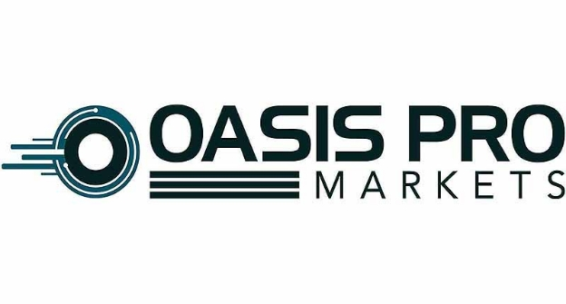

# Oasis Pro deal will give developing world better access to financial markets
### **Partnership aims to break dominance banks have on low-risk investment from primary bond markets**
 26 September 2021[ Anthony Quinn](tmp//en/blog/authors/anthony-quinn/page-1/) 2 mins read

### [**Anthony Quinn**](tmp//en/blog/authors/anthony-quinn/page-1/)
Editor

Marketing & Communications

- 
- 
- 
- 

IOHK and Oasis Pro have formed a ground-breaking partnership to develop an alternative trading system that will use blockchain technology to open up participation in primary bond markets to developing countries.

The two companies are joining forces to create a bond issuance platform. Oasis Pro is the parent company of Oasis Pro Markets, which already operates a multi-asset alternative trading system called OATSPRO in the US. This allows secondary trading of public and private multi-asset digital securities.

The Oasis Pro technology facilitates digital cash for digital securities transactions, and the use of the Cardano blockchain to remove the need for intermediaries such as banks from the process will cut trading fees by half. The combined platform provides a viable and secure financing alternative for governments of developing nations.

With recent reductions in foreign aid and investment, many governments are struggling to access capital. The integration of OATSPRO technology with users of Cardano’s ada cryptocurrency – with a market capitalization of $70 billion – will enable a new source of foreign investment to be tapped for crucial infrastructure projects.

John O’Connor, director of African operations at IO Global, said: ‘At IO Global, our mission is to build systems which widen and democratize access to vital financial and social services, for both governments and citizens alike. This was the drive for our partnership with the Ethiopian Ministry of Education this year to bring provable educational credentials to students and teachers across the country, and it is the same for our work with Oasis.

‘Systems like the one Oasis is developing are essential to bridge the growing global investment gap and give developing nations the tools to level the playing field and invest in critical infrastructure.’

Pat LaVecchia, chief executive of Oasis, said: ‘Developing nations often lack the access to overseas capital that other nations have. We want to ensure that this changes. IO Global’s vision to democratize opportunity aligns closely with our desire to ensure access to financial markets for developing nations, and this partnership represents a key step in enabling greater accessibility to international capital markets for those that require it.’
