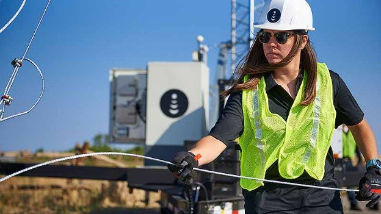

# US mobile operator calls on Cardano
### **Dish Network aims to create services for 20m TV and Boost cellular subscribers**
 28 September 2021[ Anthony Quinn](tmp//en/blog/authors/anthony-quinn/page-1/) 2 mins read

### [**Anthony Quinn**](tmp//en/blog/authors/anthony-quinn/page-1/)
Editor

Marketing & Communications

- 
- 
- 
- 

Dish Network and Input Output Global (IOG) have formed a strategic collaboration to explore using the Cardano blockchain across the Nasdaq-listed US satellite television and cellular network group. 

The two companies aim to build new services for customers of the Boost mobile network, Dish satellite TV, and Sling streaming television service. Between them, Dish has 11.4 million TV subscribers and 9.4 million wireless subscribers.

Dish announced this month it had chosen to implement IBM technology for its 5G mobile phone network, which aims to cover at least a fifth of the 383-million-strong US population by next summer.

Charles Hoskinson, chief executive of IOG, sees great potential for the use of distributed ledger technology in the telecoms industry. ‘Today, when we look at telco, we see intersections between the use of identity and the movement of data, and as Dish unleashes its next generation network, we see tremendous opportunity to move these innovations forward together.’

Dish became a nationwide wireless carrier in 2020 when it took over Boost, and is now building the first virtualized broadband network in the US, based on open radio access network ([O-RAN](https://www.o-ran.org/)) technology.  

Chris Ergen, head of the innovation office at Dish Wireless said: ‘Dish has always been a leader in innovation within its business and industry. With this endeavor, we find ourselves at the intersection of two rapidly changing and radically transformative industries; blockchain and telecommunications. Both ecosystems somewhat depend on each other for survival and scale, while maintaining security and privacy. 

‘It’s a really exciting time in both fields, and we’re thrilled to be working with Charles, the IOG team and the Cardano community to develop great systems that many will find useful.’ 

[Dish Network](https://about.dish.com/company-info) was formed 1980 and listed on the Nasdaq exchange in 1995. It is now one of the 200 largest US companies by revenue in the ranking compiled by *Fortune*, the business magazine. ‘I see Dish as a rebel in the telco space, dating back to the early days of the company,” said Hoskinson. ‘They've gone through many iterations and innovations, and every step of the way they were always leading and transforming their entire industry.’ 

IOHK is already working to build new [mobile services in Africa with World Mobile](https://iohk.io/en/blog/posts/2021/08/11/connecting-the-unconnected-banking-the-unbanked/).

*Catch up on all the announcements from the [Cardano Summit 2021](https://summit.cardano.org/) website and [IOHK’s Twitter](https://twitter.com/InputOutputHK).*
