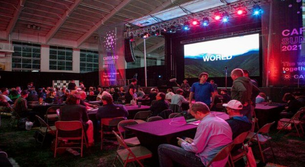

# Building on the Cardano Summit
### **As well as a showcase for all things Cardano, the summit weekend also provided a platform for working with our growing developer community**
 12 October 2021[ Fernando Sanchez](tmp//en/blog/authors/fernando-sanchez/page-1/) 6 mins read

### [**Fernando Sanchez**](tmp//en/blog/authors/fernando-sanchez/page-1/)
Technical Writer

Marketing and Communications

- 
- 

The recent two-day [Cardano Summit](https://summit.cardano.org/) offered the perfect opportunity to interact with the global developer community. This landmark event became the stage where Cardano, its partners, and developers came together to form a synergistic whole of creativity and interaction. This collaboration yielded some impressive results. 

IOG teams organized, or were closely involved with coding challenges and hackathons that served to showcase the evolving potential of Cardano for hosting decentralized applications (DApps) and smart contracts. We learned a lot from these experiences, and had a lot of fun doing it.

Two particular events stand out: the Plutus Capstone Challenge, which was organized and hosted by IOG (special hat tip to the IO community team’s Matthew Capps for his efforts), and the WyoHackathon, an event that ran concurrently to the Cardano Summit. IOG teams helped organize some of the challenge categories at this event, with IOG's Hernán Rajchert and Pablo Lamela acting as judges.
### **Plutus Capstone Challenge**
Cardano has reached many milestones in recent months, including the delivery of a ‘programmable’ mainnet and smart contracts with the Alonzo hard fork.

A new development ecosystem is now emerging, with the Plutus Pioneer program as one of its cornerstone community initiatives. Two cohorts have graduated since the program's launch in early March 2021, with over three thousand taking this valuable primer in Plutus and functional programming.

As well as a celebration of the journey so far, we wanted to use the Cardano Summit to recognize our Plutus Pioneers and Plutus developer partners and offer them the chance to showcase their skills with a ‘capstone’ event.

Our Summit Capstone event brought together developers from around the world to solve coding challenges. The challenges were specifically chosen to provide tools that the whole community could use to help them build Plutus decentralized applications (DApps), a chain index explorer, for example. The event consisted of a per-region 8-hour period, following the sun from Asia-Pacific, through Europe, and to the United States. The event ended as the sun set on Saturday.
### **About the event**
For each region, a team of experienced Plutus engineers from IOG and five partner companies mentored the participants. We kept the Capstone deliberately low-key and informal – a learning experience, and ‘testbed’ for future events. Still, participants were eager and took the challenges seriously. In particular, the IOG team was struck by the attendees’ desire to work together and invest longer than the allotted time in working out complex solutions.

We received very positive feedback on the communication and organization of the event itself, and especially on the quality of support provided by the Plutus experts at IOG, [Metalamp](https://en.metalamp.io/), [MLabs](https://mlabs.city/), [Obsidian](https://www.obsidians.io/), and DQuadrant. Three of our mentors were graduates from a 2020 Haskell training course by Dr. Lars Brünjes. It’s fantastic to see this positive evolution, as these graduates have now reached a stage where they are able to help developers build Plutus applications. We also saw the beginning of the use of Cardano Stack Exchange, with problems being posted, soon followed by solutions.

By the end of the event, teams of pioneers had made 16 polished submissions, reasoning about and attempting to solve challenges. These included NFT-authentication for DApps, distribution tools for Cardano-API wallet-funds, designing a trinket-to-gold ‘smelter’ game for concurrency, and many others.

Apart from the satisfaction of bringing Cardano developers together in this celebration of our budding Plutus community, the enthusiasm and positive uptake of this foundational coding challenge encourages us to run more in the future. We plan to extend competition periods, include team events, and turn on event marketing to bring the whole developer ecosystem into the fun.
### **The winners**
This Plutus Pioneer Capstone brought together Pioneers, our partners, and our IOG teams in a synergistic effort that really paid off. 

The winners of the Capstone event 2021 were, by region:

**APAC Asia Region**

- [NFT Authentication Tool](https://github.com/ganeshnithyanandam/OAuth-NFT), by ganesh#9022 - $5,000 prize

**EMEA Europe Region**

- [Cardano-CLI Wallet Test Tool](https://github.com/domy2018developer/ppc-emea), by domy2018developer#8139 - $2,000 prize
- [Cardano-CLI Transaction Editor](https://github.com/Titan-C/cardano.el), by #Titan-c#2872 - $1,000 prize
- [Cardano-CLI Integration Testing toolkit](https://github.com/zwilling/plutus-integration-testing-toolkit), by flippy#1542 - $500 prize
- ["Tokenomia" - Native Tokens Toolbox](https://github.com/smart-chain-fr/tokenomia), by Nicolas Henin [Smart Chain]#7822 - $500 prize

**USA Region**

- [Win-win Dispute Resolution Application](https://github.com/Loxe-Inc/mediation-contract), by mks#4918 - $5,000 prize
- [PiggyBank Savings Application](https://github.com/eselkin/param-pb-pab), by eponymousEli#4492 - $3,000 prize

It was a great start to IOG’s plans for similar events over the coming months. Congratulations to all the winners and thanks to everyone who took part.
### **WyoHackathon 2021**
Meanwhile in Laramie, Wyoming, there was a weekend event that ran from 6pm on Friday September 24th to 9am on Sunday September 26th, with people taking part live from the University of Wyoming, or online from anywhere in the world using Discord and submitting their entries through DevPost. Representatives from IOG contributed to the event by helping with some challenge categories and acting as judges. 

The WyoHackathon featured several categories, with 140 participants and 20 submissions registered in total.

The IOG team helped to organize two [Marlowe](https://docs.cardano.org/marlowe/learn-about-marlowe)-related categories. 

- Marlowe contracts - Find existing financial agreements that could be modeled as Marlowe contracts and develop them inside the [Marlowe Playground](https://alpha.marlowe.iohkdev.io/#/)
- Marlowe future - Envision how you might modify the various components of the Marlowe Suite
### **Prizes**
There were five submissions to the Marlowe categories, and the prizes were distributed as follows.

The winning entries for the Marlowe contracts category were:

- #1 ($5,000 prize) - [Pass through billing](https://devpost.com/software/marlowe-contract-pass-through-billing) - Considers the scenario where a vendor resells or lends a product to a client and takes a commission depending on whether there is a dispute.
- #2 ($2,000 prize) - [Pizza delivery](https://devpost.com/software/marlowe-pizza-delivery-accountability-contract) - A contract that gives a partial (or full) refund, depending on how late the delivery was. The implementation only asked the client, so it didn’t consider the possibility of a malicious client.
- #3 ($1,000 prize) - [Turing toil](https://devpost.com/software/proof-of-workout) - Uses a hypothetical oracle that returns muscle strength to incentivize two gym buddies to motivate them and motivate each other.

There was just one winning entry for the Marlowe future category:

- #1 ($1,000 prize) - [Company Merger](https://devpost.com/software/marlowe-company-merger) - Takes stocks from two different companies and combines them, considering the value of the original stocks according to a hypothetical oracle.

We would also like to thank Colin Hobbins from the Plutus engineering team for participating on-site on the presentation of the Hackathon, and Kegan McIlwain and Stone Olguin for supporting participants on-site and over Discord.

Speaking about the event, IOHK researcher and developer Pablo Lamela said 'It was very refreshing to see how original all the submissions were. I think this kind of insight will help us know how to make Marlowe even better and more useful for users.'
### **Conclusion**
The Capstone event confirmed that there is great interest in Cardano amongst the developer community following the Alonzo update. Cardano is now a versatile, scalable platform that supports DApps and smart contracts, something that has been warmly welcomed by the wider community.

The Summit was just a 48 hours-long event, but that doesn't mean that our close collaboration with the community ends there. Quite the opposite. We will continue developing and expanding Cardano's features over the coming weeks and months, providing the developer community with the required tools and support to interact with our ecosystem.

*Catch up on all the announcements and sessions from the [Cardano Summit 2021](https://summit.cardano.org/) website and [IOG’s Twitter](https://twitter.com/InputOutputHK).*
