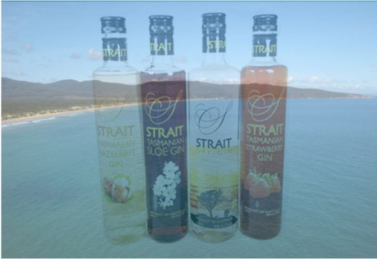

# Bringing premium spirits to the Cardano blockchain
### **Enhancing the customer experience with blockchain-based supply chain authentication**
 22 October 2021[ Neil Burgess](tmp//en/blog/authors/neil-burgess/page-1/) 2 mins read

### [**Neil Burgess**](tmp//en/blog/authors/neil-burgess/page-1/)
Technical Writer

Marketing & Communications

- 
- 

Imagine buying a bottle of super premium spirits. Scan it with an app on your phone, and you know for certain that it is a genuine product, never opened or tampered with, and every ingredient can be traced to its source. All this without needing to trust the retailer or anyone in the supply chain.

That’s authentication security, and it will soon be a reality for customers of [Strait Brands](https://www.foodandbeveragetasmania.com/partner/strait-brands/), an Australian producer of international award-winning spirits since 2006. 

At the [Cardano Summit 2021](https://summit.cardano.org/), IOG's [Dan Friedman](https://iohk.io/en/team/daniel-friedman) talked with [Philip Ridyard](https://downginlane.com.au/the-story-behind-strait-brands-distillery/), Strait Brands founder and MD, about using [Atala SCAN](https://iohk.io/en/enterprise/#product-authentication) for blockchain-based supply chain accreditation. Based in the Tamar Valley in Tasmania, Strait Brands is partnering with [Input Output](https://iog.io/) to embed Atala SCAN into their production and distribution processes. Watch the [full interview](https://summit.cardano.org/sessions/no-longer-a-luxury-blockchain-backed-product-authentication).

Philip’s experience exporting to Asian countries has shown him the prevalence of counterfeiting and substitution in those markets. In the alcohol industry alone, counterfeited, mislabeled, substituted, or diluted products worth upwards of $40 billion a year are making their way to consumers. After ten years of searching, Philip has found the ideal solution in the immutability and auditability of blockchain technology, and ideal partners in the people of Input Output like Dan Friedman.

As Philip says, ‘For the launch of a super premium brand, to have super premium authentication and traceability is absolutely paramount.’ This authentication allows Strait Brands to offer not only the taste and texture of the product but the whole intellectual package that makes up the value offering. That includes the geographical location of Strait Brands in Tasmania, the pristine spring water, the agreements with local growers, the responsibly sourced ingredients, and the custom bottles. There will be four million bottles with Atala-compatible stoppers produced locally and distributed worldwide.

This partnership is timed to coincide with the coming release of a super-premium range to be known as Badger Head. The name comes from Badger Head Road, where the distillery is located, and from the term used by the British to describe the local wombats. The packaging includes a wombat motif.

Strait Brands is even planning a special Cardano-themed limited edition matched with CNFTs. More details of this will be announced soon!
