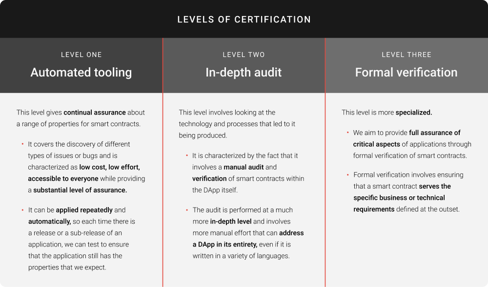

# New certification levels for smart contracts on Cardano
### **Certification will bring high assurance to the development of decentralized applications (DApps) on Cardano**
 25 October 2021[ Niamh Ahern](tmp//en/blog/authors/niamh-ahern/page-1/) 5 mins read

### [**Niamh Ahern**](tmp//en/blog/authors/niamh-ahern/page-1/)
Education Manager

Education

- 
- 
- 
- 

High assurance is paramount when developing and working with smart contracts. You want to be confident that the source code is of a high quality, that the contract is secure and will behave as it should, and that it utilizes good properties and behaviors in the process. Certification ensures that security checks are performed prior to any deployment, and that smart contracts can be continually audited as they are updated. It provides benefits to both smart contract developers and end users, helping protect user funds and project reputations alike from coding errors or exploits.

At September’s [Cardano Summit 2021](https://summit.cardano.org/), we laid out our plans on the introduction of new levels of certification for decentralized applications (DApps) running on Cardano. This certification program will provide levels of quality for DApps and their internal smart contacts.

This initiative has been led by [Professor Simon Thompson](https://iohk.io/en/team/simon-thompson), technical project director at IOG, and [Shruti Appiah](https://iohk.io/en/team/shruti-appiah), head of product at IOG. It will help us comply with the best practices we’ve seen around the industry. We are working with [Runtime Verification](https://runtimeverification.com/), [Tweag](https://www.tweag.io/), [Well Typed](https://well-typed.com/), [Certik](https://www.certik.io/), and others to roll out this new certification program that will link in with the new dAppStore, also unveiled in prototype form at the summit. This will be released in conjunction with the new light wallet.
## **What are the different certification levels?**
There are *three* levels of certification, each of which is complementary to the others, rather than being progressive in terms of assurance and auditing purposes.

### **Level one: Automated tooling**
This certification level gives continual assurance about a range of properties for smart contracts. It covers the discovery of different types of issues or bugs and is characterized as low cost, low effort, accessible to everyone while providing a substantial level of assurance.

It can be applied repeatedly and automatically, so each time there is a release or a sub-release of an application, we can test to ensure that the application still has the properties that we expect.
### **Level two: In-depth audit**
This level involves looking at the technology and processes that led to it being produced. It is characterized by the fact that it involves a manual audit and verification of smart contracts within the DApp itself.

The testing is performed at a much more in-depth level and involves more manual effort that can address a DApp in its entirety, even if it is written in a variety of languages.
### **Level three: Formal verification**
This level is more specialized where we aim to provide full assurance of critical aspects of applications through formal verification of smart contracts. Formal verification involves ensuring that a smart contract serves the specific business or technical requirements defined at the outset. 
## **What kind of assurance can we expect?**
Certification will ensure the correctness, compliance, and consistency of requirements by both application developers and auditors. It will also guarantee the absence of common security vulnerabilities and provide a level of robustness, reliability, and maintenance of DApps deployed on Cardano. While certification will be strongly encouraged and the store curated accordingly, it will not however be mandatory or act as any kind of ‘gatekeeper’ thus maintaining a balance between the need for user assurance and decentralized principles.

By auditing the specifications and design and ideation phases, you can present evidence to the community and guarantee that things will work as expected. This evidence includes documentation of requirements to a detailed level, thereby creating a reference point for the future.
## **Certification status in the dAppStore**
We plan to integrate this certification with the new dAppStore that we are building to provide cryptographically secure non-fungible tokens (NFTs) that give evidence of the levels of certification that we will guarantee. The dAppStore will be part of a light wallet that IO is developing, and users will be able to access the light wallet and dAppStore using a web browser, and in the store to view the certification status of each DApp as they browse through the categories and individual applications. Making the relevant certification status visible to users during the selection process will offer reassurance on quality and safety for users in their choice of DApps. 

To learn more about our dAppStore plans, you can watch a concept walkthrough on the [dAppStore summit video](https://summit.cardano.org/sessions/redefining-dapp-discovery-bringing-dapps-to-the-mass-market).
## **What is next for certification?**
Professor Thompson says:

We want to build support from the industry for emerging standards of certification. In the longer term, we will work with our partners and others to articulate best practices, which may involve forming an umbrella industry body to define new standards and practices for this domain. 

We also plan to work with our ecosystem of partners to support certification of the first DApps on Cardano; one of a number of DEXs looking to launch on Cardano this year [SundaeSwap](https://sundaeswap.finance/) also announced their plans at the summit to certify.

It is still early days. There are some technical challenges that we are busy working through about how we support versioning of DApps, how they will be packaged, and how to make them available to automated tooling. However, we are very excited about this journey with our partners and the general community to deliver a secure platform and applications built on top of it.

To learn even more about certification levels, and meet some of the partners on the program, make sure you watch the [<https://summit.cardano.org/sessions/smart-contract-certification-the-why-and-how>) from the Cardano summit.
