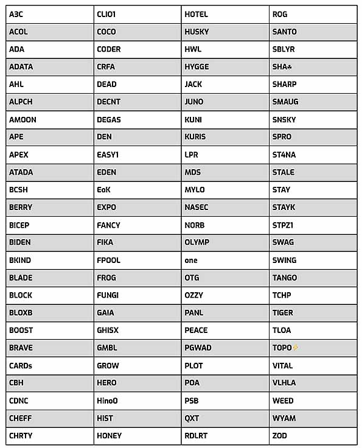

# IOG's third round of delegation gives voice to stake pool operators
### **Choice of 100 recipients for ada stake based on nominations**
 27 October 2021[ Dominic Swords](tmp//en/blog/authors/dominic-swords/page-1/) 4 mins read

### [**Dominic Swords**](tmp//en/blog/authors/dominic-swords/page-1/)
Writer and editor

Marketing & Communications

- 

The 100 Cardano stake pools to benefit from the third IOG delegation have been announced. They were chosen from 520 nominations made by stake pool operators, based on contributions to the Cardano community.

All the pools chosen will receive delegated stake of about 3m ada from IOG, in a [strategy to encourage a vibrant pool ecosystem](https://iohk.io/en/blog/posts/2021/01/22/our-new-delegation-strategy-announcing-the-pools-we-are-supporting/). By delegating this large stake to a pool for several months, IOG increases that pool's chances of minting the latest block of data on the blockchain. When a block is produced, the pool earns rewards that are split between the pool’s operators and every ada holder who has delegated to the pool.

Most of the pool operators who got involved – 84% – nominated another pool, and 7% entered just to promote another pool and didn't apply for delegation for themselves. All the pools that received delegation were nominated by other operators.

‘The selection process, although driven by the nominations of all 520 pools that took part, was discretionary,' said Ben O’Hanlon, IOG’s head of community, insights and engagement. 'But we’re clear that the 100 chosen reflect the voice of the community.’

He added: ‘A key difference between proof-of-work and proof-of-stake is that POW extracts value from the network. In POS, stake pool operators have to attract delegation, so they have a stronger relationship with other stakeholders in the ecosystem. This is why nominations are so interesting.’

Participation with others to build, create and educate is one of the salient characteristics of those selected. More than 30 tools and resources created or being developed by SPOs have been added to the [Essential Cardano](https://github.com/input-output-hk/essential-cardano/blob/main/essential-cardano-list.md) page on GitHub. This makes it easier for people to find their way around the ecosystem, and [GitHub users can add their suggestions.](https://github.com/input-output-hk/essential-cardano#want-to-contribute)

Here is the table of the 100 successful pools.

Whereas the first two rounds of delegation were about giving a leg-up to mission-driven and smaller, or ‘incubator’, pools, in this round pools were asked to nominate contributions by operators that they considered outstanding. Stake pool operators (SPOs) were also asked questions about environmental matters such as green energy use. (Their answers will be published in a follow-up post.)

‘Something that the first two delegation rounds revealed was that SPOs wanted all the good work they saw being done silently to be recognized,’ said O’Hanlon. ‘This is the feedback we heard, and so we acted on it and gave SPOs the opportunity to nominate.’

Although not everyone will agree on every delegation decision, it's important to remember how much progress has been made since the start of the year and what a success the strategy has been. When the staking process was set up, IOG ran 20 public pools to which it delegated the stake from its own ada. All but one of these were retired in December last year and part of the stake was moved to private pools through the delegation process. The first ‘call for delegation’ was on December 10 (Ada Lovelace’s birthday).

In the second round, more emphasis was placed on mission-driven pools, geographical distribution (to minimize connectivity failure), social and community activity (to keep ‘telling the story’ of the Cardano blockchain), and support for the lower-middle-sized ‘core’ of the network.

This third round opened as Cardano achieved one of its key goals – 100% of block production in the hands of the pools. Running a stake pool is a competitive business, and there are no guaranteed outcomes, but IOG has directly supported pools with 300 delegations so far as part of this strategy!

You can discover more about the latest 100 successful pools, and all the 3,000-odd active pools, at [Adapools](https://adapools.org/) or [Pooltool](https://pooltool.io/). On these community-built platforms, you can search on each ticker-like name for more information. Their search functions work differently and it's worth spending a bit of time looking at the differences.
