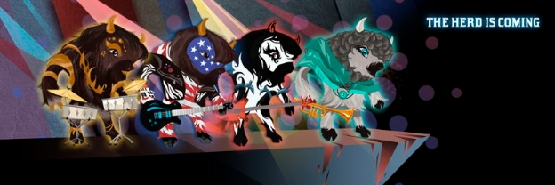

# Buffalo soldiers march to the heart of the blockchain
### **Crypto Bisons is a musical NFT game unveiled at the 2021 summit – and it has far-reaching implications for a host of other applications**
 28 October 2021[ Dominic Swords](tmp//en/blog/authors/dominic-swords/page-1/) 4 mins read

### [**Dominic Swords**](tmp//en/blog/authors/dominic-swords/page-1/)
Writer and editor

Marketing & Communications

- 

You want to demonstrate a unique combination of blockchain functions, bringing real-world elements together with collectibles and smart contracts. Of course you’d like to have a massive cohort of willing creative participants just ready and waiting to develop it. 

It’s time to call in the guitar-playing bisons, obviously. 

*Crypto Bisons*, a blockchain-enabled NFT game unveiled at Cardano Summit 2021, is based on an original concept from Charles Hoskinson, who, as well as founding Cardano, is a long-time gamer and game designer. He is also the owner of a herd of 500 or so bison. Because, why not?

To see where the idea would go, Hoskinson enlisted the help of by six students at [Enjmin](https://enjmin.cnam.fr/cnam-enjmin/presentation/ecole-nationale-du-jeu-et-des-medias-interactifs-numeriques-1036162.kjsp)\*, the national digital game school of France in Angoulême. ‘We said to them, “Have some fun with it and see what you guys can do.” And it’s absolutely remarkable to see, month by month, the level of creativity and the convergence to something that actually has very practical gameplay mechanics,’ said Hoskinson. 

Karim Sellami, who managed the French team, said: ‘The first question that we had as students was not about gaming at all, but what happens in your field when you have so many bison! One day one of the bison had a fall and it made a noise and it was exciting, and then music is born. We thought about what will happen if all the bison discover music.’

But why a game? ‘Multiplayer games are a great use-case for blockchain,’ said Romain Pellerin, IOG technology chief. ‘You have the players, and they need to connect to a system and be logged in somewhere. With blockchain you have your log-in – it’s your wallet.’

Players form bands whose members are bison. Each bison has its own personality, which develops as the game world evolves. And a bison avatar is incomplete without a saxophone, right? Or a guitar. And if it’s a buffalo soldier, it’s going to need dreadlocks too. Well, there’s your collectibles. 

The music the bison bands play is another function of the digital world: it’s algorithmically generated. ‘The original design brief was that we wanted to do something where we combine NFTs, algorithmically generated music and blockchain together with a geolocation component,’ said Hoskinson. 

‘It's a great experiment to take NFTs to the next level. Until recently NFTs were considered static things. They were pictures, videos – it was like owning a letter or something like that. It didn’t change; it was just there and, you know, it could be traded and so forth.’

In *Crypto Bisons*, by contrast, the way the game object is used over time, from game to game, and even on to other platforms outside the game, affects its usability. ‘And so that's really a great experiment to conduct. You know, this also has very practical infrastructural implications on Cardano,’ said Hoskinson.

And where the bison go, others are sure to follow. ‘The bridging of the physical real world with the digital blockchain world – it hasn't really been done much before. Once that’s done, you can use it as a template for anything in the physical world. It can be artwork, it can be other types of animals, it can be people, places, these types of things.’

Pellerin added: ‘The game objects can be shared across games, not only within games. You could reuse them in different games but also in other entertainment support, your own music, other video games, platforms, and social networks. Finally, the logic and the scenario can be represented as a smart contract to evolve the scenario but also the game object. So we are very ambitious for this game. It’s going to bring great innovation that will lead to standards, because we have to design what is a game object on an NFT standard. And you can have many versions of the game standard, and that will lead to greater research.’

Another thing Hoskinson likes about the game is that players compete against each other in a creative, rather than a destructive, way. The bison just want to play their way into the musical hall of fame.

(\* École nationale du jeu et des médias interactifs numériques)

Catch up on all the announcements from the [Cardano Summit 2021](https://summit.cardano.org/) website and [IOHK’s Twitter](https://twitter.com/InputOutputHK).
