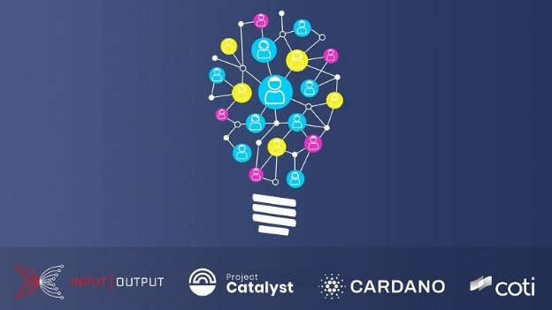

# Introducing Catalyst Natives - How any business can leverage the Cardano innovation engine
### **As part of the broader Catalyst project, the Catalyst Natives program opens up the potential of blockchain technology to new use cases for everyday businesses of all sizes**
 10 November 2021[ Fernando Sanchez](tmp//en/blog/authors/fernando-sanchez/page-1/) 5 mins read

### [**Fernando Sanchez**](tmp//en/blog/authors/fernando-sanchez/page-1/)
Technical Writer

Marketing and Communications

- 
- 

We are excited to announce the first Catalyst Natives pilot, as part of [Project Catalyst](https://iohk.io/en/blog/posts/2021/02/12/our-million-dollar-baby-project-catalyst/), Cardano’s community-driven innovation engine. Catalyst Natives enables any organization to leverage the crowd’s power to solve business problems and outsource the implementation of solutions. This project opens up the potential of blockchain technology to new use cases for everyday businesses, both large and small.

We’re launching a series of pilots, firstly in conjunction with [COTI](https://coti.io/), an enterprise-grade fintech company that empowers organizations to build their payment solutions. COTI has developed, in partnership with Cardano, a very user-friendly and scalable ada payment solution for the community. As a result, online merchants, from a small hotel in Europe to a big e-commerce website in Asia, can easily accept hundreds or thousands of ada transactions by integrating [adaPay](https://adapay.finance/) into their site.

When asked about the partnership Shahaf Bar-Geffen the CEO of COTI, he said:

We are very excited to be the first company to launch a Catalyst Native fund. As close partners, it is only natural for COTI, IOHK, and Cardano Foundation to collaborate once again to allow teams from all over the world to take part in the adaPay development and participate in our challenge. Finding new innovative ways to enrich adaPay will value not only the Cardano and COTI communities but the entire world by allowing a very wide variety of merchants to accept ada as a payment method.
### **Project Catalyst**
In less than a year, Project Catalyst has grown to become the world’s largest decentralized innovation fund. It is a center for future development and sustainable innovation, driven by the Cardano community, for the Cardano community. In this initial pilot of Catalyst Natives, we are opening the gateway to organizations outside of the Cardano ecosystem to harness the transformative power of the Project Catalyst innovation engine.

At each funding round, Project Catalyst has presented several challenges for the community to collaborate on and deliver solutions. Now, with the launch of [Fund 7](https://bit.ly/3qzYYP8), there is $8m worth of ada available, 80% of which is set aside for project funding and 20% is available for rewards incentives for voters and community advisors. Fund 7 consists of 24 challenges, 21 of those challenges were proposed by and voted for by the community, two challenges were proposed by [IOG](https://iohk.io/), and the Catalyst natives pilot in collaboration with COTI. The Catalyst community votes on the presented solutions and the winners of that vote receive funding to complete their projects.
### **Catalyst Natives**
Catalyst Natives extends access to Project Catalyst functionality like the Cardano [native tokens](https://docs.cardano.org/native-tokens/learn) feature extends the range of tokens on the Cardano blockchain.

With the introduction of Catalyst Natives, organizations outside of the Cardano/Catalyst ecosystem can also present challenges and offer incentives and rewards to those who successfully meet the challenge with their proposed innovations. 

In this pilot, COTI offers an innovative technical challenge to our communities. All small and medium enterprises currently using platforms such as Shopify and WooCommerce will be able to benefit from new and creative ways to accept ada payments with seamless integration by adding a plug-in to their site. 

Following the pilot, we will be opening Catalyst Natives to receive further challenges from other external organizations, these challenges in the initial phase will be curated by IOG to ensure they add value to the wider Cardano ecosystem. Organizations submitting challenges through Natives will provide the funding for those proposals, meaning that Catalyst Natives do not use the Cardano Treasury funding to pay for the successfully voted-for projects. In Fund 7, COTI provides $100k worth of COTI tokens plus costs, which is over and above the existing $8 million ada fund. 

Catalyst Natives is a fantastic proposition for organizations of all shapes and sizes to gain access to a veritable trove of ideas and to those with the skills to realize them. Catalyst Natives is currently looking to help partners and native asset token projects in the Cardano ecosystem address specific pain points that they either do not have the resources to resolve or simply do not have a solution for, and outsource them as Catalyst challenges for proposers to address.

As the future rolls toward us at an ever-increasing pace, organizations must adapt to constantly changing market conditions and systems like Catalyst may pave the way for disruption in how people collaborate and make decisions beyond the Cardano community. Emerging markets make planning exceptionally challenging. This uncertainty is why the ability to tap into a think tank as and when needed and outsource implementation is highly valuable and may be the differentiating factor in competitive market spaces.
### **How to apply to Catalyst Natives**
Do you have a specific business problem and would like to take part in the next Catalyst Natives pilot? Please apply [here](https://forms.gle/BA8LmtrAWWmHHcY59) and take the next steps towards accessing untapped potential.
### **Where to find out more about Project Catalyst?**
- [Catalyst Newsletter](https://bit.ly/3dSZJvx)
- [Catalyst Announcements Channel](https://t.me/cardanocatalyst)
- [Catalyst Community Chat](https://t.me/ProjectCatalystChat)
- [Catalyst Fund 7 Launch Guide](https://bit.ly/3qzYYP8)
- [Browse Projects](https://cardano.ideascale.com)
##### ***Tim Richmond, communications manager at IOG, also contributed to this article.***
