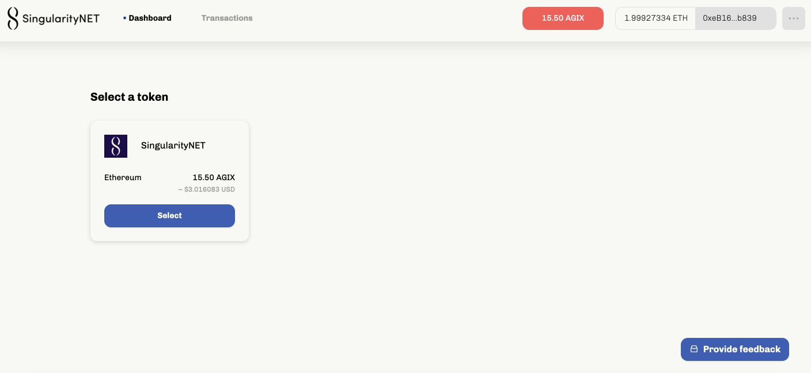
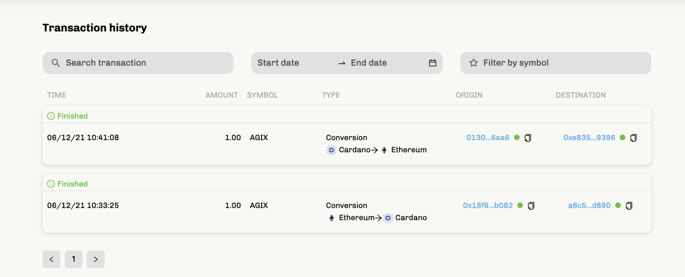

# The AGIX ERC20 converter testnet is now live
### **A public testnet is available for you to try out the migration of AGIX tokens to the Cardano ecosystem**
 7 December 2021[ Olga Hryniuk](tmp//en/blog/authors/olga-hryniuk/page-1/) 6 mins read

### [**Olga Hryniuk**](tmp//en/blog/authors/olga-hryniuk/page-1/)
Technical Writer

Marketing & Communications

- 
- 

In our [previous blog post](https://iohk.io/en/blog/posts/2021/05/17/bringing-erc20-to-cardano/) earlier this summer, we shared how Cardano would support the migration of ERC20 tokens from Ethereum, working initially with SingularityNET and their AGIX token. Today we can announce that the AGIX ERC20 converter testnet is live and ready for community evaluation. 

[S](https://singularitynet.io/)[ingularityNET](https://singularitynet.io/) is our first partner in this initiative. And the converter is a significant step in our shared journey towards a much deeper collaboration with the SingularityNET community. 

Dr. Ben Goertzel, CEO and Chief Scientist at SingularityNET says:

I'm extremely excited by the emergence of the AGIX-ADA/AGIX-ETH converter onto Cardano testnet, and soon after that onto mainnet. Every revolution is carried out one step at a time, and this is the first in a series of steps whose result will be the porting of the full SingularityNET decentralized AI platform onto Cardano. The importance of this port for SingularityNET and the whole blockchain and AI ecosystems cannot be overestimated – it will yield not only a far faster and more economical AI network, but also a massively superior foundation for adding advanced new functions to SingularityNET and moving toward realizing our vision of decentralized AGI.

In this initial [testnet ve](https://testnet.agix-converter.iohk.io/)[rsi](https://testnet.agix-converter.iohk.io/)[on](https://testnet.agix-converter.iohk.io/), users can move SingularityNET’s AGIX tokens to Cardano and back to Ethereum via the permissioned bridge. This marks a significant step forward in driving interoperability between blockchains to establish a functional environment for decentralized finance (DeFi). Users can assess the capabilities of the testnet and pilot the transfer of AGIX tokens to benefit from Cardano’s higher transaction capacity, lower fees, and proven security benefits. 
## **Blockchain bridges power interoperability**
Blockchain interoperability is key to boosting adoption and growth for the entire space. Alongside our open-source approach, this has always been one of our priorities – to make blockchain solutions accessible for everyone, regardless of the chosen protocol. However, speed of transaction processing, security properties, and scalability are critical to satisfying the needs of the crypto community. 

We are currently building out and collaborating on multiple bridges to connect Cardano to other blockchains, and this first converter is a vital artery in this system. The more these connections grow, the higher the network effect to boost the flow of liquidity within the Cardano ecosystem. 

So, let’s take a closer look at how exactly the AGIX ERC20 converter tool works. 
## **Working with the converter**
The converter enables the migration of AGIX ERC20-based tokens from the source network to Cardano. Users can access the converter via a URL and move their tokens in just a few clicks. The converter ‘translates’ an ERC20 token into a native token on Cardano with the same value and functionality, which can be moved into Daedalus or Yoroi wallets to make payments or other transactions. The built-in conversion system allows the tokens to be converted back into ERC20 format, if desired.

Users do not need technical expertise or coding experience to use the converter. They simply access the tool through a URL and then proceed by creating a new account or configuring an existing Metamask account. 

It is essential to configure the associated Cardano address, which corresponds to either a [testnet Daedalus](https://testnets.cardano.org/en/testnets/cardano/get-started/wallet/) or [Yoroi Nightly](https://chrome.google.com/webstore/detail/yoroi-nightly/poonlenmfdfbjfeeballhiibknlknepo) wallet to store the migrated tokens. After initial setup, users are welcome to use some testnet AGIX and Ethereum Kovan test network (KETH) tokens to start testing the tool. 

The converter reflects the token balance and its equivalent value in US dollars on the token card on a dashboard: 

Figure 1. ERC20 converter dashboard

**Token migration**

To migrate testnet tokens to Cardano, users need to select the token card, choose the amount, and click the *Convert* button:

Figure 2. The process of token migration from Ethereum to Cardano

The user will be notified once the transaction is processed both on the Cardano and Ethereum Kovan testnets, and the balance will update accordingly.

For the reverse process, the user needs to click the conversion arrow to point to the target blockchain. The system will notify the user about smart contract execution, and the steps to follow. 

The converter provides a user-friendly interface that features tips, notifications, and additional information to guide users throughout their token migration journey. For example, the testnet version of the converter utilizes the Kovan test network. If a user is in a different environment, the system will notify the user to change networks. The same applies to the Cardano address setup, sending values that exceed the actual balance, and so on.

Finally, all the activity can be tracked on both blockchain explorers:

- [Kovan Etherscan](https://kovan.etherscan.io/) and
- [Cardano testnet explorer](https://explorer.cardano-testnet.iohkdev.io/en)

It is also possible to check recent transactions in the converter’s *Transaction history* section:

Figure 3. ERC20 converter transaction history
## **What’s next?**
Our commercial team is now running the process to allow for secure and seamless token migration from other blockchains and sidechains to Cardano. Projects who want to initiate a dialog can [get in touch here](https://iohk.io/en/contact-commercial). We will continue pursuing Cardano’s interoperability mission across a range of permissioned and permissionless, producing a mesh of interconnected sidechains with decentralized applications (DApps) written in Solidity, Glow, and more. This will expand the base ecosystem of DApps written in Plutus on Cardano.

Following our philosophy where security comes first, we are treating the converter deployment with the highest scrutiny to always secure the funds of individuals. That is why we are inviting the community to put it through its paces on the testnet while the code is constantly monitored and audited to ensure that everything is working properly. While the user flow and UI for the testnet converter will likely be very similar on mainnet, the current build is not yet optimized for performance. The testnet phase is an essential part of this process, gathering user data – particularly at times of high network saturation – will help us address this and improve throughput as we get closer to the mainnet launch.

Ready to try out the AGIX converter? First, make sure to visit the dedicated [testnet page with step-by-step instructions](https://testnets.cardano.org/en/testnets/erc20-converter/erc20-overview/). And if you’re ready to get started, then go to the [ERC20 converter](https://testnet.agix-converter.iohk.io/) – the testnet is now live and waiting for you to try it out!
