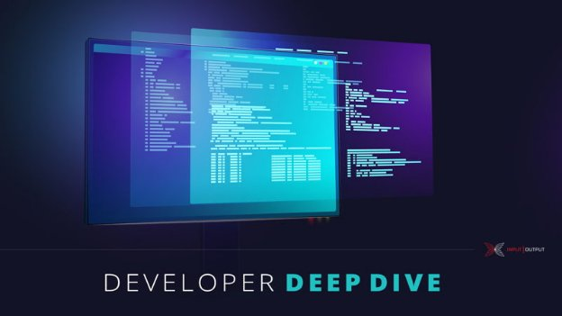

# Simple property-based tests for Plutus validators
### **How to write off-chain code with the 'cooked-validators' library and get property-based tests for free**
 27 January 2022[ Victor Cacciari Miraldo](tmp//en/blog/authors/victor-miraldo/page-1/) 8 mins read

### [**Victor Cacciari Miraldo**](tmp//en/blog/authors/victor-miraldo/page-1/)
Software Engineer

*We recently heard from [Victor Miraldo](https://victorcmiraldo.github.io/), who leads the smart contract verification and auditing team at [Tweag](https://www.tweag.io/), about the importance of verification for security reasons in the world of decentralized finance (DeFi). Victor is a Haskell and formal methods engineer committed to ensuring the safety and correctness of decentralized apps (DApps) through tools and processes. In this blog post he outlines how writing and deploying a DApp is simply not enough, and why every developer should thoroughly test all on-chain code and Plutus scripts against a range of bad actors. For that, he introduces a library of ready-made tools for interacting with Plutus validator scripts – called [cooked-validators](https://github.com/tweag/plutus-libs/tree/main/cooked-validators), developed at Tweag. This library helps implement the innermost layer of off-chain code, which is responsible for generating and submitting transactions. By using this library you can get property-based tests at the transaction level for free.*

*Let's hear what Victor had to say about using their library.*
## **Introduction**
Transaction-level tests enable us to submit arbitrary transactions to the validator scripts and to assess their behavior. This process differs from testing a whole smart contract using the defined endpoints as part of the off-chain code of the contract. After all, that off-chain code was designed to seamlessly cooperate with the on-chain code and will have its own intrinsic security and safety checks. This method works for normal operations, but in a testing setup, it often shields on-chain validator scripts from ill-formed or even malicious inputs. Therefore, for transaction-level testing, we want to circumvent the sanitising off-chain code and hammer on-chain scripts with all the same might that an attacker’s hand-crafted off-chain infrastructure might bring. As an analogy with web services, you often want to test your server by sending it arbitrary requests, in addition to those requests that are permitted by the client's user interface.

The cooked-validators library enables you to write the off-chain code responsible for generating and submitting transactions and use the same code for executing and testing your contract, at the transaction-level. This makes it much easier to write tests for the on-chain that can detect whether a number of bad things can or cannot happen.
## **About the 'cooked-validators' library**
Building your contracts with cooked-validators isn't very different from what you are already used to with the Contract monad. Say you followed the [tutorial on the Split](https://plutus-apps.readthedocs.io/en/latest/plutus/tutorials/basic-apps.html#defining-the-validator-script) contract up to and including the ‘Defining the validator script’ section. At the end, you have a [splitValidator](https://github.com/tweag/plutus-libs/blob/30f4c061cc8d38e5968bbb6418b40a6f4e9e25fa/examples/src/Split.hs) function that executes the *on-chain* part of that contract. If you did not follow the tutorial, the splitValidator contract locks a certain amount of funds that can only be unlocked by being split funds between two previously specified parties.

Now, to interact with that contract itself, we need to write the *off-chain* code, which generates and sends the necessary transactions to the blockchain. Instead of doing that directly in the Contract monad, we'll rely on the cooked-validators library. The [lockFunds](https://plutus-apps.readthedocs.io/en/latest/plutus/tutorials/basic-apps.html#locking-the-funds) transaction can be written as follows:

lockFunds :: (MonadBlockChain m) => SplitData -> m ()

lockFunds s@SplitData{amount} = void $ validateTxConstr

`  `[PaysScript splitValidator [(datum, Ada.toValue amount)]]

This is very similar to the [lockFunds](https://plutus-apps.readthedocs.io/en/latest/plutus/tutorials/basic-apps.html#locking-the-funds) we'd have written in the Contract monad directly. The difference being that here we used an arbitrary [MonadBlockChain](https://github.com/tweag/plutus-libs/blob/30f4c061cc8d38e5968bbb6418b40a6f4e9e25fa/cooked-validators/src/Cooked/MockChain/Monad.hs#L45) monad. This technique enables us to use the same lockFunds for two purposes:

1. generating the transaction, since the Contract monad is an instance of MonadBlockChain, and
1. writing tests for the *on-chain* validators using the cooked-validators facilities.

Let's say that we've also defined the unlockFunds transactions ([code to use](https://github.com/tweag/plutus-libs/blob/30f4c061cc8d38e5968bbb6418b40a6f4e9e25fa/examples/src/Split/OffChain.hs#L54)), so that cooked-validators will interact seamlessly with the Contract monad. In fact, we can define the endpoints function just like in [the tutorial](https://plutus-apps.readthedocs.io/en/latest/plutus/tutorials/basic-apps.html#deploying-the-app-on-the-playground):

endpoints :: (AsContractError e) => Promise w SplitSchema e ()

endpoints = selectList [lock, unlock]

`  `where

`    `lock = endpoint @"lock" (lockFunds . mkSplitData)

`    `unlock = endpoint @"unlock" (const unlockFunds)
## **Testing the contract**
Because we have defined the first layer of our off-chain code (which generates and submits raw transactions) with cooked-validators, we can use its testing infrastructure to test the *on-chain* validators. A basic test of whether it is possible to unlock funds that have been locked could look like this:

unlockPossible1 = assertSucceeds $ do

`  `lockFunds sd `as` wallet 1 -- sends the lockFunds pretending to be user 1,

`  `unlockFunds `as` wallet 2 -- sends the unlockFunds pretending to be user 2.

where

`  `-- makes a split of 10 ada between users 2 and 3 that only those users should be able to unlock.

`  `sd = SplitData (wallet 2) (wallet 3) 10

Here, the as combinator only works when testing code and it enables us to interact with our contract in the same way as many users would.

The function unlockPossible1 is a unit test that checks whether something good happens. We can just as easily test that something bad does *not* happen:

unlockImpossible1 = assertFails $ do

`  `lockFunds sd `as` wallet 1

`  `unlockFunds `as` wallet 5 -- user 5 shouldn't be able to unlock the funds.

where

`  `sd = SplitData (wallet 2) (wallet 3) 10

We can also use these tests as *property-based tests*. In this case, the property being tested is that either of the two recipients of the split can always unlock:

unlockProp1 = forAllTr tr assertSucceeds

`  `where

`    `tr = do

`      `-- generates a random SplitData

`      `sd <- genSplitData

`      `-- generates a random wallet; anyone can lock funds.

`      `w <- genArbitraryWallet

`      `lockFunds sd `as` w

`      `-- but only the recipients can unlock the funds

`      `unlocker <- choose [ recipient1 params , recipient2 params ]

`      `unlockFunds `as` unlocker

Additionally, if one of our tests fails, we will receive a readable summary of the transactions that caused the test to fail. Here's an excerpt of the first three transactions from a test failure of a more involved validator:

\1) ValidateTxSkel

`     `- Signers: [wallet #1 (a2c20c)]

`     `- Label: ProposalSkel 2(Payment{paymentAmount = 4200000,paymentRecipient = a96a66})

`     `- Constraints:

`        `/\ Mints

`            `- (18ab4cc $ "threadToken"): 1

`            `- Policies: [18ab4c]

`        `/\ PaysScript script 9d52e00:

`            `- Accumulator{payment = Payment{paymentAmount = 4200000,paymentRecipient = a96a66},signees = []}

`              `{ Lovelace: 6200000

`                `(18ab4cc $ "threadToken"): 1 }

\2) ValidateTxSkel

`     `- Signers: [wallet #1 (a2c20c)]

`     `- Constraints:

`        `/\ PaysScript script 9d52e00:

`            `- Sign{signPk = a2c20c,signSignature = 8fef22}

`              `Lovelace: 1

\3) ValidateTxSkel

`     `- Signers: [wallet #2 (80a4f4)]

`     `- Constraints:

`        `/\ PaysScript script 9d52e00:

`            `- Sign{signPk = 80a4f4,signSignature = 6853e0}

`              `Lovelace: 1

...

The trace that is displayed to the developer contains all the information necessary to debug the issue, and it tries to present the information in a readable manner.

In addition to property-based testing, cooked-validators also provides the ability to modify transactions in a trace according to some function. This can simulate an attack in many different ways. For example, writing a test such as:

attackNotPossibleOnSplit = assertFails $ do

`  `somewhere doAttack $ do

`    `lockFunds sd `as` wallet 1

`    `unlockFunds `as` wallet 2

` `where

`  `sd = SplitData (wallet 2) (wallet 3) 10

will cause cooked-validators to attempt to execute two tests, both of which should fail, as follows:

1. modify the lockFunds sd transaction according to doAttack, then submit; then submit an unmodified unlockFunds or
1. submit lockFunds sd; then modify and submit unlockFunds according to doAttack.

The details of the somewhere combinator can get a little complex, hence we will omit it here. There is a separate [blog post](https://www.tweag.io/blog/2022-01-26-property-based-testing-of-monadic-code) giving the technical details on the Tweag blog for those who are interested.
## **Related libraries and conclusion**
Although Plutus [already supports](https://plutus-pioneer-program.readthedocs.io/en/latest/pioneer/week8.html#property-based-testing) a form of property-based testing of contract endpoints with its [ContractModel](https://marlowe-playground-staging.plutus.aws.iohkdev.io/doc/haddock/plutus-contract/html/Plutus-Contract-Test-ContractModel.html) class, it does not provide transaction-level testing. Transaction-level testing is very important for us at Tweag. When auditing a Plutus contract, we need to be able to act like an attacker and modify transactions to study how the validators will react.

By using cooked-validators to develop your off-chain code, you will be able to test many safety and correctness properties of your on-chain code, and this can greatly increase your confidence in the correctness of the code. That can save time and money during an audit. In fact, the first step of a Tweag audit is to write the transaction-generating code using cooked-validators, to then be able to interact with our client's infrastructure freely.
