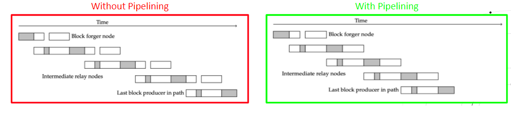
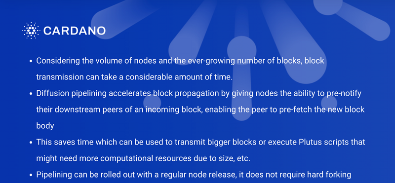

# Introducing pipelining: Cardano's consensus layer scaling solution
### **Pipelining is one of the key scaling improvements to be deployed in 2022. Here’s how it works and why it matters**
 1 February 2022[ John Woods](tmp//en/blog/authors/john-woods/page-1/) 4 mins read

### [**John Woods**](tmp//en/blog/authors/john-woods/page-1/)
Director of Cardano Architecture

Engineering

- 
- 
- 

You’d be forgiven for thinking that pipelining sounds like a remodelling procedure a plumber might employ. In a way, this isn’t too far from the truth. Pipelining is, effectively, an evolution in Cardano’s ‘plumbing’. It is a key element in our scaling plan this year, one in the series of [published steps](https://iohk.io/en/blog/posts/2022/01/14/how-we-re-scaling-cardano-in-2022/#modal=https://ucarecdn.com/fc644130-c13d-43f9-a966-14290687d190/) covering our methodical approach to flex Cardano’s capacity as the ecosystem grows.

Scaling and throughput are crucial considerations for any blockchain, if growth and competitiveness are to be maintained. As Cardano enters the Basho phase of development, we're laser-focused on ensuring that Cardano scales to meet the growing needs of the ecosystem. In other words, we need to ensure that the underlying protocol – Ouroboros Praos – operates fast enough for the plethora of decentralized applications now deploying or lining up to launch on Cardano.

Cardano will continue to be steadily optimized in a series of measured steps, carefully & methodically scaling #Cardano for future growth as demand increases. The changes introduced by the release of node 1.33.0 in early January gave us additional headroom to modify some network parameters, including block size and memory units. Adjustments here have a direct bearing on how Cardano handles network traffic in volume and we continue to monitor network performance closely.

Continuing close observation of real world network performance and - importantly - the cumulative impact of parameter changes will be key throughout this process. Following each update, we carefully monitor and assess across at least one epoch (5 days) before continuing with further adjustments. As much as extensive research and engineering work has gone into designing and deploying the system, a decentralized network architecture needs to be scaled based on real world user behaviours and usage.
## **Introducing pipelining**
Pipelining – or more precisely, diffusion pipelining – is an improvement to the consensus layer that facilitates faster block propagation. It enables even greater gains in headroom, which will enable further increases to Cardano's performance and competitiveness.

To understand how this technique achieves its intended goal, let's recap how blocks propagate at present.

Currently, a block goes through six steps as it moves across the chain:

1. Block header transmission
1. Block header validation
1. Block body request and transmission
1. Block body validation and local chain extension
1. Block header transmission to downstream nodes
1. Block body transmission to downstream nodes

A block’s journey is a very serialized one. All steps happen in the same sequence every time, at every node. Considering the volume of nodes and the ever-growing number of blocks, block transmission takes a considerable amount of time.

Diffusion pipelining overlays some of those steps on top of each other so they happen concurrently. This saves time and increases throughput.

 The time saving afforded by this technique will lead to even more headroom to further scale Cardano, including changes to: 

- Block size - the bigger the block, the more transactions and scripts it can carry
- Plutus memory limits - the amount of memory available for a Plutus script to run
- Plutus CPU limits - more computational resources can be allocated for a script to run more efficiently
## **Implementing pipelining**
One of the design principles behind diffusion pipelining was to achieve faster block propagation while avoiding ‘destructive’ changes to the chain. We did not want to remove any of the protocols, primitives, or interactions already happening in Cardano, because nodes rely on these established mechanisms. We wanted full backwards compatibility, so instead of changing the way things currently work, we're adding a new mini-protocol whose job is to pre-notify subscribed entities when a new desirable block is seen, prior to full validation.

The key change introduced by pipelining is the ability to pre-notify peers and give them a block before it is validated, which enables the downstream peer to pre-fetch the new block body. This saves a lot of time because we dramatically reduce the time it takes to validate a block across the multiple hops.
## **In conclusion**
Pipelining is just one of the pillars supporting Cardano's scaling this year. Combined, all these changes will lead Cardano to a position where it is faster than its competitors, and a highly competitive platform for decentralized finance (DeFi) this year.
## **Key takeaways**

***Fernando Sanchez contributed to this article.***
