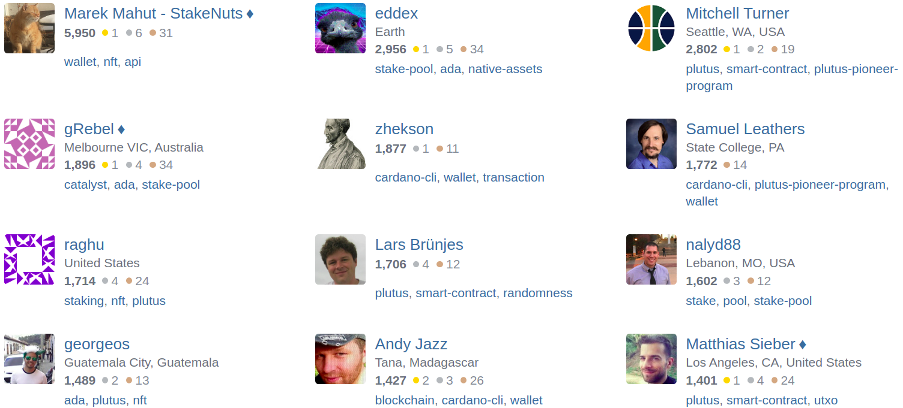

# The knowledge base for Cardano is growing: Cardano Stack Exchange graduates from Beta version
### **A fresh Q&A site will facilitate knowledge-sharing for all Cardano related topics**
 7 February 2022[ Ignacio Calderon de la Barca](tmp//en/blog/authors/gonzalo-ignacio-calderon-de-la-barca-rodo/page-1/) 4 mins read

### [**Ignacio Calderon de la Barca**](tmp//en/blog/authors/gonzalo-ignacio-calderon-de-la-barca-rodo/page-1/)
Technical Community Manager - Plutus

Marketing & Communication

- 
- 
- 
- 

[Cardano Stack Exchange (CSE)](https://cardano.stackexchange.com/), a community-driven knowledge base for Cardano, is now recognized by Stack Exchange as a mature learning community, putting it in a class with some of the biggest knowledge curation sites on the internet. 

The demand for in-depth technical knowledge about Cardano has consistently increased as more people invest their time in [building on Cardano](https://twitter.com/InputOutputHK/status/1488131603691884550). Such demand couldn’t (and shouldn’t) be met by any single entity, and that led to the community-driven approach of CSE.

Plutus developers, researchers, stake pool operators, Cardano project team members, and founding entities – experts of all stripes from around the ecosystem – have come together to meet this demand. The fact that CSE has graduated from its trial period – dropping the ‘Beta’ label – confirms that it has reached a critical mass of *useful, decentralized knowledge*.
## **From ‘Area 51’ to full site: the Stack Exchange journey**
The Cardano community anticipated the value of having a Stack Exchange site early on. It has been 10 months since a group of community visionaries launched CSE in the Stack Exchange ‘Area 51’ site, an initiative championed by community member [raghu](https://cardano.stackexchange.com/users/12/raghu). 

Since then, a diverse group of community members put their passion and knowledge to work curating information and documenting solutions for the Cardano ecosystem. 

The company behind Stack Exchange facilitates and referees the launch of new communities, and the process is far from easy. For a Stack Exchange initiative to fully launch, it goes through six steps: Discussion, Proposal, Community Commitment, Private Beta, Public Beta, and Graduation. 

Conquering them all is a major accomplishment. The ongoing success of this project would not have been possible without the help of many contributors; we make a special acknowledgement of the work of CSE moderators [Marek Mahut](https://cardano.stackexchange.com/users/28/marek-mahut-stakenuts), [Matthias Sieber](https://cardano.stackexchange.com/users/934/matthias-sieber) & [Glenn Rieger](https://cardano.stackexchange.com/users/281/grebel); IOG team members [Lars Brünjes](https://cardano.stackexchange.com/users/186/lars-br%c3%bcnjes) & [Samuel Leathers](https://cardano.stackexchange.com/users/382/samuel-leathers); and the effort of top users like [eddex](https://cardano.stackexchange.com/users/1142/eddex), [Mitchell Turner](https://cardano.stackexchange.com/users/1130/mitchell-turner), [zhekson](https://cardano.stackexchange.com/users/4302/zhekson), [nalyd88](https://cardano.stackexchange.com/users/62/nalyd88), [gorgeos](https://cardano.stackexchange.com/users/1231/georgeos), & [Andy Jazz](https://cardano.stackexchange.com/users/4023/andy-jazz). Additionally, we thank Hassan Khalil for his work on the Beta site analytics.

Refer to the image below, top users, their reputation and most answered topics are included.

## **Future vision**
[Stack Exchange](https://stackexchange.com/) is a model for Q&A-focused knowledge curation, as well as being a federation of learning communities empowered through merit-based editorial powers and moderator elections. The importance of this platform becomes evident (especially in the context of open source projects) by noting the example of its most iconic representative: [Stack Overflow](https://stackoverflow.com/). Stack Overflow has long been a key community hub for developers, paving the way for the success and adoption of all the most popular programming languages.

The winning strategy in tech is to leverage a self-governing, self-sustaining community.

So, what does this mean for CSE’s journey? We have just ticked off a major milestone; however, this is only the beginning of a long term vision for the platform. As hinted above, CSE has the potential to enrich [Plutus](https://iohk.io/en/blog/posts/2021/04/13/plutus-what-you-need-to-know/) and [Marlowe](https://iohk.io/en/blog/posts/2020/10/06/marlowe-industry-scale-finance-contracts-for-cardano/) development, similar to the way that Stack Overflow enriched Python, Javascript, and C.
## **Get involved**
This is already the place where developers meet and share knowledge. The next step is to increase the quality of engagement and elevate the creative range of the user base for our ecosystem’s native programming languages, our protocol, and the full Cardano stack. 

To the Technical Community: expect Discord Stages targeted to CSE, here we will highlight top CSE questions and answers and discuss interesting concepts of many topics dealing with building in Cardano.

If you are a developer or Cardano enthusiast, get involved. When you do, keep in mind to maintain [best practices](https://cardano.stackexchange.com/help) as you vote, comment, ask and help others. If you are new to the platform, here are the highlights of what you can achieve:

- Gain reputation by asking and answering questions. 
- Collect badges to guide your upleveling in the platform.

- Get specialized information, by filtering questions under tags (e.g., plutus, plutustx, cardano-node, etc…).

What does a strong question or answer look like? We’ve pulled an example for you from CSE with key points noted.

- Cites important sources, and quotes the most relevant passages.
- Includes formatting (e.g., lists, bold, or italics) to emphasize key information.
- Broken into paragraphs for understanding.
- A comments function for improving the quality of the post.

Moving from beta is not only an important milestone. It's also a good reminder of the power of community action to add exponential value and the ‘compounding’ of knowledge that comes when we work together. We have all been part of this journey, and now we need to keep up the good work.

*I’d like to thank Matthew Capps for his input and contribution in preparing this blog post.*
