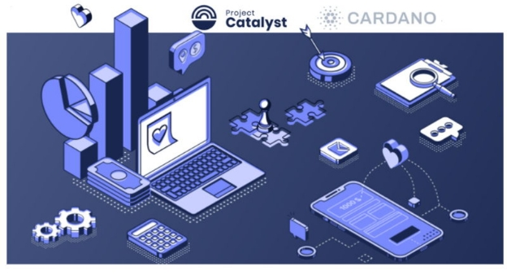
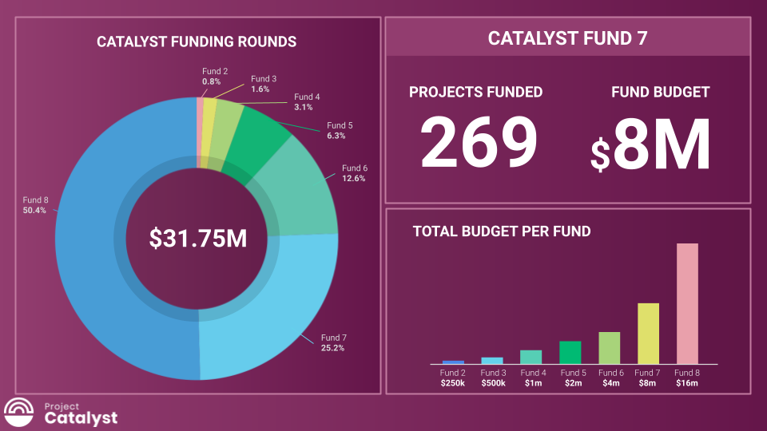

# Project Catalyst, Cardano’s innovation engine, launches Fund8!
### **Project Catalyst is a turbo-charged engine for Cardano, accelerating the ecosystem’s growth and making dreams come true**
 2 March 2022[ Kriss Baird](tmp//en/blog/authors/kriss-braid/page-1/) 4 mins read

### [**Kriss Baird**](tmp//en/blog/authors/kriss-braid/page-1/)
Product Owner

Commercial

- 
- 
- 

Every three months, a new Project Catalyst innovation fund campaign begins with the opportunity to receive resources paid in ada from the Cardano Treasury. Valuable resources to build, create, and contribute to realize great ideas worthy of funding. 

In little over a year, what began as an experiment in collaboration, competition, and elevating human potential has become the world’s largest decentralized innovation fund. The latest iteration, Fund8, will control $16m in ada, check out the [Fund8 Launch Guide](https://bit.ly/3vFgEvl).

A global community comes together to propose, evaluate, and ultimately decide which proposal submissions should be funded. Everything including new decentralized finance (DeFi) applications to address financial inclusion inequalities. Or [RealFi](https://iohk.io/en/blog/posts/2021/11/25/welcome-to-the-age-of-realfi/), which creates an ecosystem of products that remove the frictions of real world economic activities and that provide cheaper credit/ financial products for real people. The [collective manufacturing project](https://wayacollective.com/) owned by African entrepreneurs and workers, for example.
### **Project milestones**
Over the past seven Catalyst funds, each and every cycle has delivered new, incredible milestones. Before we look forward to what is in store for Fund8, let’s observe the achievements that have just come to pass during our last round.

In Fund7, once votes were counted and tallied, [269 new proposals were chosen to receive ada](https://drive.google.com/file/d/193GZulHuk0zhpTrMiLhcNC4OeEMoRyIa/view). A staggering amount given that each of these projects was in response to 24 real-world challenges proposed by the Cardano community and one further challenge set by Cardano’s first [Catalyst Native](https://iohk.io/en/blog/posts/2021/11/10/introducing-catalyst-natives-how-any-business-can-leverage-the-cardano-innovation-engine/) pioneer, COTI. Catalyst Natives is Cardano’s new initiative to provide decentralized innovation fund management to partners looking to grow their ecosystem by incentivising innovators to help build solutions to challenges that Catalyst Native partners set. 

More that 52,500 wallets registered to vote and community advisors participated in reviewing more than 900 proposals this time around to help inform voters’ decisions. 

In a very short period of time, the number of proposals being funded from the [Cardano Treasury](https://iohk.io/blog/posts/2020/09/10/project-catalyst-voltaire-bring-power-to-the-people/) has nearly doubled to 575 projects. Crucially, we have now seen over 1 million votes cast since the first Project Catalyst community vote in Fund2. 

At the time of writing, the Cardano Treasury holds approximately 800m ada to sustain and grow the ecosystem. Many projects funded in previous rounds have now completed and are [demonstrating their outcomes](https://docs.google.com/spreadsheets/d/1bfnWFa94Y7Zj0G7dtpo9W1nAYGovJbswipxiHT4UE3g/edit#gid=416498551). 

As the project rotates to the new fund campaign, another inspiring milestone has been reached. Every single challenge in Fund8 has been set and decided by the Catalyst community. The goal? To accelerate the developer and DApp ecosystem within Cardano’s open source framework. 23 challenges span across themes such as Cardano Ecosystem Foundations & Development, Community Development, Outreach & Adoption, Identity & Interoperability, and Project Catalyst Improvements. 

2022 is set to eclipse the achievements of the last 12 months, with innovations and projects being propelled forward by people just like you, reading this blog today. Have an idea? Why not apply?
### **How to get involved?**
On Thursday 24th February 2022, proposal submissions opened. Proposers were originally given one week to submit a draft proposal, and two additional weeks to refine and finalize submissions. This draft submission deadline has now been lifted, there is no longer a draft deadline, and instead we will be accepting proposal submissions up until 11am UTC on March 17th.

There are many ways to get involved with Project Catalyst. As an innovator, voter, commenter, proposal reviewer, or even a mentor. The first step is [making an account on our collaboration platform](https://cardano.ideascale.com/). Another way is to come join the Project Catalyst community every Wednesday at TownHall which is live streamed on our [YouTube Channel](https://www.youtube.com/c/IohkIo). If you have an idea, or are just curious to explore what’s going on at the heart of Cardano, join us and become part of the Project Catalyst Community. 

To learn more about [Project Catalyst](https://iohk.io/en/blog/posts/2021/02/12/our-million-dollar-baby-project-catalyst), or to take part and answer challenges posted by others through Project Catalyst, please subscribe to the [Catalyst mailing list](https://bit.ly/3dSZJvx) and join our [Telegram community](https://t.me/cardanocatalyst), where we’d be delighted to welcome you.
