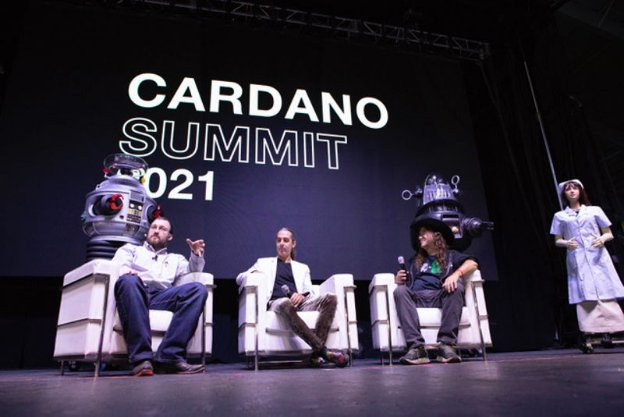

# The critical role of AI / blockchain synergy in humanity’s future
### **A guest blog post by AI and blockchain pioneer, SingularityNET’s Dr. Ben Goertzel**
 30 March 2022[ Dr. Ben Goertzel](tmp//en/blog/authors/ben-goertzel/page-1/) 8 mins read

### [**Dr. Ben Goertzel**](tmp//en/blog/authors/ben-goertzel/page-1/)
CEO and Chief Scientist at SingularityNET

Guest author

- 
- 

The global economy is becoming increasingly complex, with sophisticated AI algorithms now able to marshall more wealth in a day than our great grandparents interacted with in their lifetimes. It is crucial that we prevent control of the emergent planetary AI network from concentrating in a few hands. Transparency and sovereignty must be appropriately architected into its infrastructure. These are the principles behind blockchain architecture. This is an exciting moment in history where the AI blockchain convergence can take place, creating a global technological economy with transparency and sovereignty baked in. AI and blockchain technologies can work together with profound implications across all sectors of human endeavor, and ultimately for the future of humanity and other sentient systems humanity may create. 

The port of the SingularityNET decentralized AI platform from Ethereum to Cardano, currently actively underway, marks one dramatic milestone in AI/blockchain convergence. SingularityNET began on Ethereum in 2017 but was always multi-chain in conception and ambition. With a mid-2021 hard fork the implementation of a version of the SingularityNET AGIX token and associated functionality across multiple blockchains became a possibility. Now this possibility is becoming a reality.

The AGIX/ADA token converter bridge, now close to completion following a period on testnet, will allow conversion between ETH and ADA versions of the AGIX token. This is the first of several steps that will ultimately result in a Cardano version of the SingularityNET platform with a greater depth and variety of AI functions than were ever possible with the original Ethereum incarnation. After the release of the Converter bridge on mainnet, development effort will focus on porting the SingularityNET marketplace, staking portal and other tools to Cardano. This will result in a platform with greater speed, lower cost and greater usability than has been possible on Ethereum. 
## **An ambitious roadmap**
Following this initial port, a variety of features leveraging the unique power and sophistication of the Cardano infrastructure will be released.

The AI-DSL (AI Domain Specific Language), which is under active collaborative development by SingularityNET and IOG since late 2020, will allow AI services on the SingularityNET/Cardano platform to describe their properties and requirements to each other using a standardized formal language. AI-DSL will support the automated assemblage of AI services into meta-services meeting customer needs.

Cardano’s use of Haskell & Plutus works elegantly with the more sophisticated type-theoretic mechanisms leveraged in the AI-DSL framework. This sort of language is needed to fulfill the ambition of SingularityNET to be more than just a decentralized marketplace of separate AI services. AI-DSL will allow SingularityNET platform to be a “primordial soup of AI” in which different AI components created by different authors come together in context-appropriate ways to form emergent AI functionalities.

For instance, in the DeFi domain, one AI agent doing altcoin price analytics, one doing news analysis using NLP and one doing abstract symbolic reasoning could come together to form a novel multi-agent approach to altcoin portfolio optimization. This assembly of AI processes could be used in one of [SingularityDAO’](http://singularitydao.io)s DynaSet bundles of Cardano Native Assets – enabling trading of user tokens locked in SingularityDAO smart contracts via algorithms not envisioned by the authors of any of the individual AI agents involved.

The potential of Cardano’s [Hydra](https://iohk.io/en/blog/posts/2022/02/03/implementing-hydra-heads-the-first-step-towards-the-full-hydra-vision/) suite of protocols for facilitating sophisticated SingularityNET AI functionalities will become clearer throughout 2022 and 2023. The Hydra Head protocol provides an elegant and powerful method for implementing the kind of state channels used in SingularityNET’s multi-party Escrow contracts. More advanced aspects of the Hydra protocols can be used more ambitiously. For the custom Cardano sidechain [HyperCycle](http://hypercycle.ai) will provide unprecedentedly scalable infrastructure for multi-agent and population-based AI systems running on SingularityNET.
## **Blockchain needs AI**
For the blockchain ecosystem to successfully fulfill its mission of decentralizing and democratizing the world economy, it will need to integrate AI deeply in multiple different ways. The SingularityNET/Cardano collaboration is uniquely well suited to lead the way in this integration.

Current work creating distributed Cardano stakepools using the NuNet decentralized-processing framework, recently spun off from SingularityNET, foreshadows what will be critical in the future for projecting the Cardano network to global scale: Cardano stakepools distributed across diverse processors via NuNet in a manner optimized by neural-symbolic AI that is itself hosted on SingularityNET-on-Cardano and running on NuNet.

Hydra will enable the introduction of various forms of sharding into the Cardano network, but agile automated management of this sort of sharding at the large scale will also require advanced AI systems. Custom SingularityNET-oriented Cardano side chains will benefit from these AI-driven sharding solutions, and also provide the needed scalable infrastructure to support the AI underlying these solutions.

Until AGI ascends beyond the human level, every decentralized network on the planet will require some sort of reputation system at its core, so that the humans involved in the network (and their software and hardware proxies) can make appropriate judgments regarding what level of trust to place in the code, transactions and devices in the network. Reputation management beyond a certain scale and complexity also requires sophisticated AI. I anticipate that SingularityNET based “proof of reputation” techniques will find their way into various networks implemented on top of the Cardano platform and perhaps ultimately into the core Cardano software itself.

Decentralized social networks, which will be critical to the next stages of humanity’s evolution culturally and politically and in so many other ways, are clearly among the networks that will rely critically on AI-driven reputation systems. Human analysts, simplistic statistical learning systems and corporate and government regulators have proven terrifyingly incapable of intelligently and ethically guiding and modulating the collective interactions of human beings in modern online social networks. AI is clearly the answer – but whose AI? The answer needs to be, everybody’s AI. 

Blockchain has clear potential to enable this. But this needs decentralized AI running on decentralized networks regulated by decentralized reputation systems. We have all these ingredients in the SingularityNET/Cardano ecosystem right now, but making them work at scale in a manner usable by the masses will be an interesting challenge over the next few years.
## **AI needs blockchain**
AI does not need blockchain in order to dominate the world economy – at the moment it is moving rapidly toward a dominant role across all vertical industries, in a manner driven largely by large centralized tech companies and governments. However, if we want this near-inevitable AI economic domination to result in broad human benefit rather than primarily serving a small sector of society, it will be critical that the architecture of the emerging global AI system is decentralized and democratic in nature. The only concrete practical path to this at the moment is blockchain technology.

Every aspect of the AI ecosystem needs to be fundamentally and thoroughly blockchain-ized, and all the blockchain networks involved need to be made massively scalable, easily usable and richly and smoothly interoperable. The good news is we have early working versions of pretty much every key aspect needed for this already. Decentralized data stores with Ocean and (for medical data) Rejuve and many others; decentralized processing power with NuNet and Golem and CPUCoin and so forth; decentralized multi-agent AI processing with SingularityNET plus alternatives like Fetch and Matrix; a decentralized knowledge graph beginning with Epik; decentralized Web infrastructure with Elastos and DFinity etc., and much more. Homomorphic encryption and multiparty computing for various AI algorithms, enabling secure and data-sovereignty-respecting AI to occur at global scale, are described in numerous research papers – but commercial-grade implementations are very limited.

But frankly, none of these decentralized tools and frameworks – including my own projects – yet works as scalably and smoothly as corresponding centralized products launched by big tech companies. This is hardly a condemnation of blockchain technologies, given that our centralized competitors include multiple trillion dollar companies with histories going back far before smart contracts were a thing. But it’s important to understand that to truly blockchain-ize the ongoing AI revolution, we in the decentralized space are going to need to travel quite a long distance in quite a short time. To do this we will need incredible-quality teams working on extremely well designed and solid technologies, and this is why I am so excited about the partnership between SingularityNET and Cardano/IOHK.
## **Humanity needs AI/blockchain synergy**
Our world today in 2022 is already best described as a sort of Global Brain Network, with the emergent intelligence of combined human / computer communication networks vastly exceeding what any individual human mind can comprehend. The intelligence, complexity and synergetic quality of this global brain is only going to increase year on year as the coordinated advance of multiple technologies leads us forward toward Technological Singularity. Slowing down progress while we figure out how best to guide it toward ethical ends seems not a practical option – there is too much upside for various powerful parties in accelerating progress in ways tailored to serve their own ends. The only realistic option for those of us concerned with humanity’s general welfare is to make sure that decentralized, democratic, beneficial development of advanced technology goes faster than centralized, tribalistic, oppressive or otherwise regressive-minded alternatives. The close integration of blockchain and AI is a key part of this, and the collaboration of SingularityNET and Cardano is currently at the forefront of this integration. The impending launch of the [AGIX token Converter bridge](https://www.youtube.com/watch?v=nEOsn7bSp0A) is a small but critical part of this tremendously important overall picture!

*The AGIX ERC20 converter bridge is scheduled to [go live](https://twitter.com/singularity_net/status/1507760834012930049?s=21&t=xyz7o1UlDSjv78ISignbVw) on mainnet on 18th April. Catch an interview with Ben Goertzel on [March’s Cardano360 show](https://twitter.com/InputOutputHK/status/1508832692686757896).*
