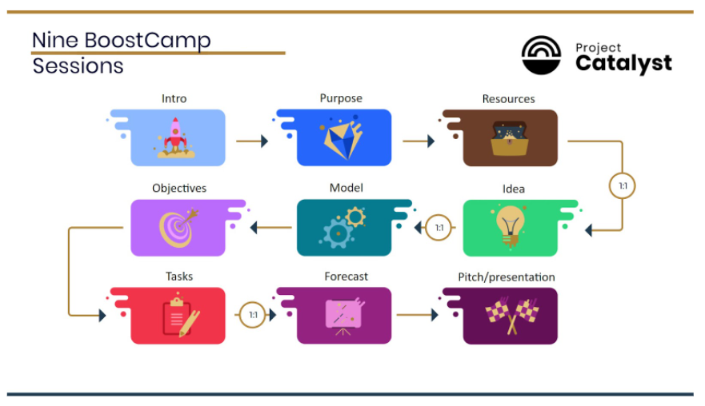

# Project Catalyst launches incubator for Africa
### **Ariob will help drive innovation and tackle everyday challenges across the continent**
 5 April 2022[ Tim Richmond](tmp//en/blog/authors/tim-richmond/page-1/) 6 mins read

### [**Tim Richmond**](tmp//en/blog/authors/tim-richmond/page-1/)
Marketing and Communications Manager

Marketing & Communications

- 
- 

Input Output Global’s Project Catalyst has launched [Ariob](http://ariob.io), an incubator scheme, in collaboration with [iceaddis](https://summit.cardano.org/sessions/building-community-in-africa), a pan-African business incubator, and accelerator. Ariob means ‘a collection of stars’ in Ge’ez, an ancient Semitic language of Ethiopia.

This strategic partnership is designed to enhance the growth of projects funded by [Project Catalyst](https://developers.cardano.org/docs/governance/project-catalyst/), Cardano’s innovation engine, and offers high potential Catalyst start-ups access to venture-building expertise and resources to help develop products that solve real-life challenges in Africa.
### **Why Africa?**
Africa is home to 1.3 billion people. It is a fascinating and diverse continent that is seeing a huge acceleration in adopting new technologies such as blockchain. Given that there are no allegiances to legacy systems, it is far easier for technological advances to take hold. Projects for financial services, national identity frameworks, and developments in academia have great potential to transform both industry and society. This evolution offers fertile ground for entrepreneurship and innovation to leapfrog over approaches stuck in the past. Therefore, a focus on delivering cutting-edge programs in Africa can accelerate the growth of the Cardano ecosystem.

Last year, Input Output Global (IOG) announced its partnership with the [Ethiopian Ministry of Education](https://iohk.io/en/blog/posts/2021/04/27/blockchain-finally-comes-of-age-with-worlds-biggest-blockchain-deployment/) to provide five million Ethiopian students with a way to verify their academic credentials using [Atala PRISM](https://atalaprism.io) technology, built on Cardano. IOG is also working with [World Mobile in Zanzibar](https://youtu.be/WSSpI8Rtif0) to connect the unconnected and enable access to essential online services through blockchain technology.
### **Project Catalyst, mentorship, and incubation**
[Project Catalyst](https://iohk.io/en/blog/posts/2021/02/12/our-million-dollar-baby-project-catalyst) is now one of the largest decentralized innovation funds. It is a focal point for ecosystem development and innovation, driven by the Cardano community. With each funding round, the community presents challenges across a range of subjects related to Cardano. These challenges are then answered by the community who present project proposals defining solutions and clear plans. The community then votes on the proposals presented and selects projects to receive funding. 

Catalyst enables people to realize great ideas and implement them, but funding is only part of the journey towards success. Other factors, such as education, mentorship, collaborations, and product roadmap development are also needed to nurture projects and help them formalize a business plan and effective go-to-market strategy.

The first entrepreneurship program, to achieve Catalyst funding entitled ‘[BoostCamps](https://www.youtube.com/watch?v=x8134D_Ip9o&t=418s)’, used the [Entreprenerdy](https://entreprenerdy.com) platform where participating projects could take part in sessions designed to develop their business strategy. Fund7 is the latest round, with an Accelerator & Mentor Challenge. Twelve projects will be funded to create programs and tools to support businesses being built on Cardano.

BoostCamps has so far taken on five cohorts, one of which focuses on projects whose goals include creating positive change in Africa. This activity inspired this newest innovation, the Ariob incubator, where a select number of projects will be chosen to join a support program running through the first half of 2022. This program offers services aimed at realizing creative potential, testing ideas, and using prototypes to find the best product. Ariob will also help connect projects with educational institutes, government organizations, NGOs, and local companies.

Markos Lemma, [iceaddis](https://www.iceaddis.com/) Co-founder, and Chief Executive said: ‘Cardano is a platform that’s creating solutions to real-life challenges in Africa and one of our most valuable relationships is with the Cardano ecosystem. Together, we want to demonstrate that the next big ideas are emerging from African countries, and we are ready to invest our resources to make that happen. 

‘As one of the leading pan-Africa incubators and accelerators, we are eager to drive the development of high-potential Catalyst start-ups through the Ariob incubator.’
### **Projects joining the Ariob incubator**
**DirectEd** is developing a solution to facilitate scholarships for students in low-income countries, using the transparency, peer-to-peer, and smart contract capabilities of blockchain technology to reduce costs and eliminate corruption. Many talented students lack the financial means to realize their potential, but philanthropists may hesitate to donate for two reasons. First, they cannot ensure that the money goes directly to the student, and second, attaching conditions to donations to ensure that funds are used for their intended purpose is costly. DirectEd solves these problems by providing a transparent, secure, and low-cost way of making conditional peer-to-peer donations directly to students.

**CheCha**: a digital USD voucher system to solve the small change crisis in Zimbabwe. CheCha acts as a trusted third party between customers and vendors to facilitate micro-loans. Vendors can join into partner networks, allowing loan redemption within their closed-loop system, and with the introduction of ada wallets, user-to-user transfers are now possible. In addition, the platform will also become the first commonly recognized liquidity market between fiat and crypto in the country.

**CanuckCrypto Ekival**: a blockchain-based escrow service that allows users to apply the Hawala system (A system for transferring money, whereby the money is paid to an agent who then instructs a remote associate to pay the final recipient.) to their money transfers. Ekival displays location-based accumulations of value (liquidity pools in the money transfer case) that users based in other locations can commit to acquiring on behalf of beneficiaries.

**Thrift Finance**: a decentralized and trustless thrift savings system governed, maintained, and upgraded by THRIFT token holders. Thrift aims to create a more accessible and efficient financial system for Africa through smart contracts.

**DeliveryChain** wants to disrupt the centralized postal industry through a peer-to-peer solution built on blockchain. The aim is to enable cheaper, faster, and more reliable parcel delivery across Africa.

**Hippocrades**: A decentralized healthcare information exchange that uses blockchain to allow information to be passed between healthcare systems without compromising security and privacy. Hippocrades also provides healthcare modules and APIs for developers to build decentralized health applications ready for Web3.

**WADA**: Building a Web3 microlending solution that empower Africans on the continent and in the diaspora. WADA’s vision is for a more inclusive economy and society, enabled through blockchain technology. 

**African Blockchain Center for Developers (ABCD)**: A talent ecosystem that seeks to mentor Africans and provide opportunities to build revolutionary projects. ABCD’s activities are geared towards closing the developer skill gap by providing learning opportunities and acting as a bridge between skilled people and potential clients. 

**Waya Collective** is building a decentralized enterprise network to find a new equilibrium in global manufacturing. The current practice of centralized production, combined with long and complex supply chains, is ever-more for everyone involved. The Waya Collective intends to provide Africa-focused producers access to loans, know-how, and a network of reliable partners in a decentralized way. 
#### **Find out more**
We’ll be following the progress of these projects as they advance through the process, so watch out for more news.

The Ariob incubator is open to all Africa-focused projects, so if you’re developing an idea, [the team would love to hear from you](https://ioincubator.com).

If you’d like to get involved by proposing a challenge, learning more about [Project Catalyst](https://iohk.io/en/blog/posts/2021/02/12/our-million-dollar-baby-project-catalyst), or would like to answer challenges posted by others, please subscribe to the [Catalyst mailing list](https://bit.ly/3dSZJvx) and join the [Catalyst Telegram community](https://t.me/cardanocatalyst).
