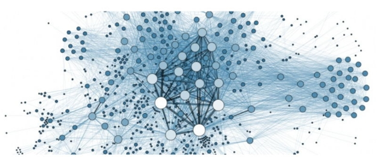

# Introducing the Concept of Delegate Representatives (dReps)
### **dReps will vote on the vast majority of proposals within Project Catalyst and enhance the quality of decision making within each Fund**
 11 April 2022[ Jack Briggs](tmp//en/blog/authors/jack-briggs/page-1/) 2 mins read

### [**Jack Briggs**](tmp//en/blog/authors/jack-briggs/page-1/)
Product Marketing Lead

Product

- 
- 

At a recent [Project Catalyst Town Hall](https://www.youtube.com/watch?v=rNZJvzjgduM), IOG announced the concept of delegating your voting power, the role of Delegate Representatives (dReps) and invited those keen to get involved to express an interest. There has been a fantastic response and we’re now excited to share more details. 

In less than a year, [Project Catalyst](https://iohk.io/en/blog/posts/2021/02/12/our-million-dollar-baby-project-catalyst) has become the world’s largest decentralized innovation fund. It is a focal point for ongoing development and sustainable innovation, driven by the Cardano community. Fund8 had nearly 1,000 proposals put forward, and Catalyst is now on track to fund over 2,100 proposals during 2022. That is staggering!

This continued expansion of the Cardano ecosystem signals fantastic news for the Cardano community as a whole. However, exponential growth poses a challenge though. As the number of proposals increases, so does the community’s responsibility to both review and vote upon them. To ensure that all proposals gain the attention they deserve, and to facilitate continued growth, a new system is required to ensure sustainability.

Delegation enables ada holders to delegate their voting power to one or many dReps. This allows the more passive voter a chance to continue to have their voice heard, but now across more proposals than they could personally read and evaluate.

These dReps will vote on the vast majority of proposals within Project Catalyst, and in turn will enhance the quality of decision making within each Fund. dReps will coordinate and form policies together, source and review data, consult with experts, and ultimately vote on an array of projects and topics that the community has brought forward.

The introduction of dReps is another exciting step forward as the community continues to learn and grow. There will be more to share and discuss over the weeks and months ahead as we roll out delegation into future Project Catalyst funds. To bolster inclusion and diversity, **IOG is reopening interest** in [joining the first dRep cohort](https://bit.ly/3rSyHvP).

Over the coming weeks, IOG will be organizing a series of workshops that go into greater detail on what it means to be a dRep, the incentive model, and what impact dReps will have on Project Catalyst.
