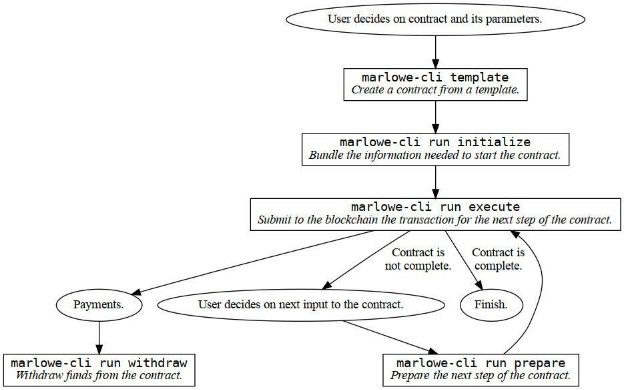

# Introducing the new command line interface tool for Marlowe
### **Learn how to submit transactions and interact with Marlowe contracts from the CLI**
 19 April 2022[ Niamh Ahern](tmp//en/blog/authors/niamh-ahern/page-1/) 5 mins read

### [**Niamh Ahern**](tmp//en/blog/authors/niamh-ahern/page-1/)
Education Manager

Education

- 
- 
- 
- 

Marlowe is an open source, domain specific language (DSL) with a suite of products for the community that will catalyze the adoption of Cardano in finance. It is constantly being enhanced and updated, and a command line interface (CLI) is just something you can't do without. So, we created a more convenient way to interact with Marlowe using the new CLI tool. This new tool supports a straightforward workflow for users who want to run contracts from the command line. It lets you focus on the Marlowe contract itself, while the tool manages details of the input and state for the contract. Additionally, it automates many aspects of Plutus as well as interaction with the Cardano node itself to reduce the burden on users.
### **Purpose**
The new [Marlowe CLI tool](https://github.com/input-output-hk/marlowe-cardano/blob/cli-blog-april2022/marlowe-cli/ReadMe.md) facilitates the internal development and testing of Marlowe contracts. This includes measuring transaction sizes, submitting transactions, testing wallet integrations, and debugging validators. It also provides integration with external developer workflows and toolsets for Marlowe contracts, similar to how the Cardano development community has heavily integrated the Cardano CLI tool into various services like libraries, faucets, token minting, marketplaces, and so on.

It is also an important step in the path of stress testing our code ahead of the official launch of Marlowe, as it provides early access to the features and capabilities on testnet and later on mainnet.

Additionally, this new CLI tool will become a useful tool for training users on how to get up to speed using Marlowe. We will be demonstrating how to use it during the upcoming Marlowe Pioneers Program which is launching in the next few weeks! Stay tuned to our [Marlowe Discord channel](https://discord.com/channels/826816523368005654/936295815926927390/936316494042779698) for details on when this course starts and how you can get involved. 
## **Running Marlowe contracts**
The marlowe-cli command supports several fine-grained and high-level workflows for running Marlowe contracts, but here we will focus on a workflow that abstracts away the specifics of Marlowe’s use of the Plutus language. The tool is installed similarly to other Cardano tools, using standard Cabal or Nix commands. Basic use just involves a couple of commands:

- Create an example contract from a template
- Initialize the contract so that the creation transaction can be submitted
- Apply inputs to a contract
- Withdraw funds from a contract
- Submit a transaction from creating, applying inputs, or withdrawing
- Query the history of a contract

Figure 1: High-level workflow for running Marlowe contracts at the command line. Each rectangle corresponds to running a marlowe-cli command.

There are several ways to design Marlowe contracts, but the easiest are to use the CLI’s template command or the [Marlowe Playground](https://iohk.io/en/blog/posts/2022/03/04/diving-deeper-into-the-marlowe-playground/). One can also create contracts programmatically using Haskell, JavaScript, or any other language that can output the required JSON files that embody the contract and its initial state. The CLI’s template command can generate simple test contracts, escrow contracts, zero-coupon bonds, token swaps, and covered calls. The Playground contains eight example contracts, but you can also design a custom Marlowe contract with it.

Once a contract has been created and its beginning state defined, the CLI’s initialize command bundles that information together with details of the Cardano network where it will be run. The single resulting JSON-format .marlowe file contains all of the information needed to run or study the Marlowe contract. In addition to the contract and its current state, it contains the address of the Marlowe validators, a serialized copy of its Plutus script, and network details. Examining and extracting information from this JSON file can be useful in learning about how Marlowe works, but isn’t necessary for running Marlowe contracts. Once this necessary information has been bundled, the CLI’s run execute command submits the actual Plutus transaction to the Cardano blockchain, prints statistics about the transaction, and awaits confirmation. 

Applying inputs to a contract follows a simpler process. The CLI’s prepare command lets you set up a deposit of funds to the contract, make a choice in it, or notify it. This takes the previous .marlowe file as input and produces a new one as output, which you can submit with the execute command. The prepare command will warn you if the input is illegal or untimely.

Withdrawing funds paid by a Marlowe contract is accomplished with the withdraw command, which allows you to select the address at which the funds will be received. Address selection provides flexibility in disbursing funds, so that the output addresses are not “hard wired” into the contract itself.

Querying the history of a contract can also be done from the command line, or you can use the Cardano blockchain explorer.
# **Prospects**
The command line tool also provides advanced features for creating and manipulating the Plutus validators, datums, redeemers, and hashes involved in Marlowe contracts. Contracts can also be compressed (using Merkle hashes), which makes it possible to run contracts far larger than the Cardano protocol limits on transaction size and memory would otherwise permit. You can also use the CLI to run Marlowe contracts on the PAB, eliminating the need for UTxO management and letting a wallet manage that instead.

This CLI tool is periodically enhanced to meet developer needs as they emerge. In addition to further simplifying Marlowe workflows, the tool’s contract-testing capabilities are being expanded. 

*Please join us on the [Marlowe Discord channel](https://discord.com/channels/826816523368005654/936295815926927390/936316494042779698) to engage in discussions, ask questions, and hear the latest Marlowe news.*

*I would like to thank Brian Bush, software engineer for Marlowe, for his help in writing this blog.*
