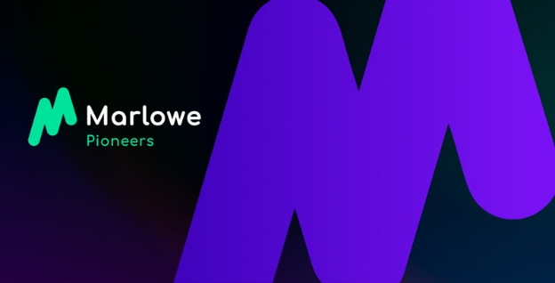

# Learn how to create low-code, low-cost financial smart contracts in the Marlowe Pioneers Program
### **Join our new Marlowe training program to discover how to easily build financial smart contacts using drag and drop**
 11 May 2022[ Niamh Ahern](tmp//en/blog/authors/niamh-ahern/page-1/) 4 mins read

### [**Niamh Ahern**](tmp//en/blog/authors/niamh-ahern/page-1/)
Education Manager

Education

- 
- 
- 
- 

Do you want to learn how to write low-cost smart contracts for finance with an easy-to-use visual tool? Then sign up for our new [Marlowe Pioneers](https://pioneers.marlowe-finance.io/) training program kicking off on May 19th. Marlowe is a web-based platform where you can build, simulate, analyze, and run financial smart contracts visually, without needing deep programming knowledge. 

Next week sees the launch of the first Marlowe Pioneer training program, where participants can learn the fundamentals of Marlowe and help to test the code before the official release. This program is designed to train developers and anyone interested in decentralized finance products to write financial smart contracts (such as loans, swaps, CFDs, and so on) using the Marlowe product suite. 

Since we announced this new course on [April's Cardano360 show](https://www.youtube.com/watch?v=b4x5OIy4shU&t=1285s), we have had strong interest from both our developer community and individuals who work in finance and are interested in learning Marlowe. 

Over the next few days we will contact everyone who registered to get a better idea of their experience and expertise. Those of you who have been selected for the first round of this program will hear from us very soon. If you don’t receive an invitation at this stage, don’t worry, as we will be running several rounds of this program, so please do stay in touch!
## **Course structure**
The first iteration of the new program starts next week on May 19th and will run for eight weeks. The cohort joining this program will be true pioneers for Marlowe and will have early access to a set of learning modules. Your feedback will help us develop and iterate the overall learning experience and make it better for those who take the course in the future.

The course will teach you the core principles of Marlowe and how to write smart contracts for the financial world. The course modules will cover the building blocks of the language, using the [Marlowe CLI tool](https://iohk.io/en/blog/posts/2022/04/19/introducing-the-new-command-line-interface-tool-for-marlowe/), the [Marlowe Playground](https://iohk.io/en/blog/posts/2022/03/04/diving-deeper-into-the-marlowe-playground/), as well as some case studies and practical exercises. 

The course will follow a modular approach and will be highly interactive. Each week we will be releasing new teaching videos from both our Marlowe product and development team and director of education, Lars Brünjes, along with a set of practical exercises to complete during the week as part of each module. We will also be holding regular interactive Q&A sessions. In addition, you will have access to a dedicated community channel on Discord, created especially to help you to connect with other course participants as you learn. 

Outside the exercises and videos, students will be encouraged to learn at a pace that is right for them and to collaborate with each other. We recommend all students invest a minimum of 8-10 hours of their time per week. As with all learning experiences, the more you put in, the more you will get out! We encourage all participants to *engage with each other* and *work collaboratively* to answer questions and solve problems. 

We will have a small team of moderators who will check in from time to time to help facilitate and assist. They can also help triage issues or questions that may come up in your learning during the week. At the close of each week, we will engage directly with the group to resolve more complex technical questions and provide feedback on the subject matter covered that week. 
## **Prior experience**
As Marlowe is a low code solution, it is not necessary to have programming experience to join this course. However, some knowledge of Haskell and JavaScript would be beneficial, as well as a general understanding of blockchain technology and financial products. You should be as keen to learn as to help us; while we have run a number of successful Pioneer Programs already for both Plutus and Atala, this is the first time we have challenged ourselves to teach Marlowe at this scale. So be prepared for road bumps along the way as we learn and improve, too!
## **When does the course start?**
The course starts next week on May 19th and will run concurrently for eight weeks through late July. It will involve approximately ten hours of your time and effort each week.
## **Ready to learn?**
We are excited to have so much interest from developers within our ecosystem who are ready to get started and learn Marlowe. You’ll not only be learning yourselves, but acting as a pioneer to help us determine the best way to teach and deliver this course – truly helping pave the way for future cohorts who enroll! We look forward to bringing you on this learning journey before we launch Marlowe to the world!

*Please join us on the [Marlowe Discord channel](https://discord.com/channels/826816523368005654/936295815926927390/936316494042779698) to engage in discussions, ask questions, and hear the latest Marlowe news.*
